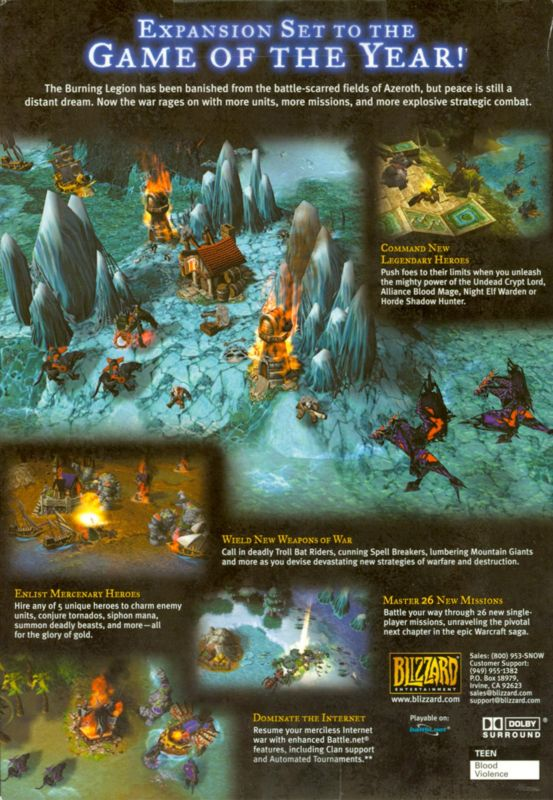
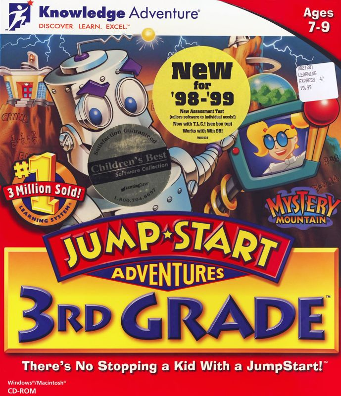

Click [here for the Rubric](rubric)

## What Is Box Art?

Box art is the artwork and design on the packaging of a video game. Before digital downloads existed, every game came in a physical box that sat on a store shelf. The box art was the first thing a potential buyer would see — it had to grab attention, communicate what the game was about, and convince someone to pick it up. Think of it like a movie poster combined with a product label. Even today, box art plays a big role in how games are marketed and remembered.

## Studying Real Box Art

Before making your own box art, look at some real examples. Below are the front and back covers of three classic PC games.

Look closely at each cover. Pay attention to what information is on the front vs. the back, how images and text are used, and what makes you want to pick up the box and learn more.

Click to enlarge the images.

  

    
    
<em>Warcraft III: The Frozen Throne — Back Cover</em>

  

  

    
    
<em>Warcraft III: The Frozen Throne — Front Cover</em>

  

  

    
    
<em>Sid Meier's Civilization III — Back Cover</em>

  

  

    
    
<em>Sid Meier's Civilization III — Front Cover</em>

  

  

    
    
<em>JumpStart — Back Cover</em>

  

  

    
    
<em>JumpStart — Front Cover</em>

  

Discuss the following with your group:

1. What do the **front covers** have in common? What is their main job?
2. What kind of information appears on the **back covers** that doesn't appear on the front?
3. Which cover makes you most interested in playing the game, and why?

## Designing Your Box Art

You are going to create box art for your group's game. Fold your paper in half so you have a **front cover** and a **back cover**. Your box art should represent the full vision of your game — not just the basic mockup you'll build in Scratch, but the complete game as you imagine it.

It's OK if your Scratch mockup ends up being much simpler than what your box art promises. Real game studios design marketing materials for the finished product, not for early prototypes. Think big!

## Box Art Checklist

Your box art should include the following. Use this as a guide while you work.

**Front Cover:**

- [ ] The title of your game, large and easy to read.
- [ ] Eye-catching artwork or illustration that represents the game.
- [ ] Your game studio name/logo somewhere on the cover.
- [ ] An age rating (make one up or use a real ESRB-style rating like E, E10+, or T).

**Back Cover:**

- [ ] A tagline or short hook — one sentence that makes someone want to play (e.g., _"It's History in the Making!"_).
- [ ] A short description (2–4 sentences) explaining what the game is about and how it plays.
- [ ] At least 2 small "screenshot" drawings showing scenes or moments from the game.
- [ ] A features list — 3 to 5 bullet points highlighting what makes your game special.
- [ ] Your game studio name/logo.
- [ ] A fictional system requirement, platform logo, or website (have fun with it).

## Rubric

See the [Box Art Rubric](rubric) for how your box art will be graded.
