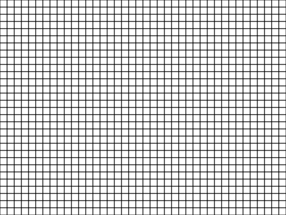

<h1>Maze Design Worksheet</h1>

  <strong>Design rules:</strong> Fill in squares to create your maze walls. Your maze must have:
  <ul>
    <li>Paths at least <strong>2 squares wide</strong></li>
    <li>A clear <strong>start (S)</strong> and <strong>finish (F)</strong></li>
    <li>At least <strong>one dead end</strong></li>
    <li>A <strong>solvable path</strong> from start to finish</li>
  </ul>

  <strong>Designed by:</strong> 
  <strong>Designed for:</strong> 

  

