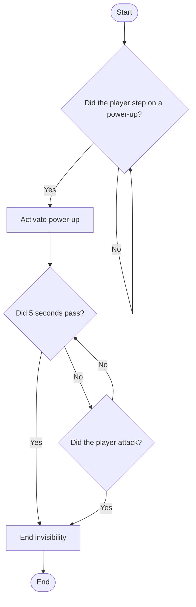

## Invisibility Powerup

```mermaid
flowchart TD
    A([Start])
    B{Did the player step on a power-up?}
    C[Activate power-up]
    D{Did 5 seconds pass?}
    E{Did the player attack?}
    F[End invisibility]
    G([End])
    A --> B
    B -- Yes --> C
    B -- No --> B
    C --> D
    D -- Yes --> F
    D -- No --> E
    E -- Yes --> F
    E -- No --> D
    F --> G
```