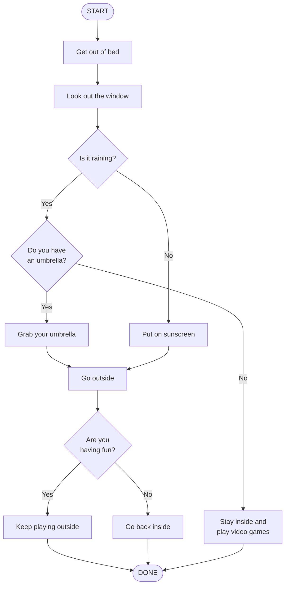
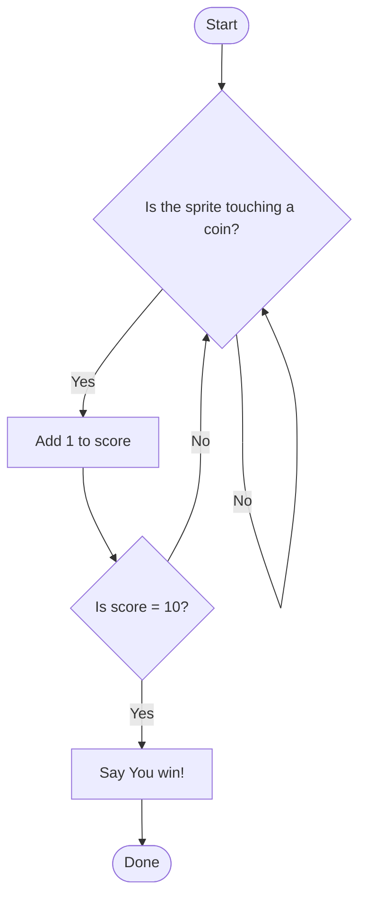

  <strong>Name:</strong> 
  <strong>Partner:</strong> 
  <strong>Period:</strong> 

<table class="shapes-table">
  <tr><th>Shape</th><th>Meaning</th><th>Example</th></tr>
  <tr><td><strong>Oval</strong></td><td>Start or End</td><td>"Start", "Done"</td></tr>
  <tr><td><strong>Rectangle</strong></td><td>Action (do something)</td><td>"Eat breakfast", "Go to school"</td></tr>
  <tr><td><strong>Diamond</strong></td><td>Decision (yes/no question)</td><td>"Is it raining?"</td></tr>
</table>

**Arrows** connect shapes and show which direction the program flows. A diamond always has **two arrows** — one for **Yes** and one for **No**.

**Example**

## Part 1: Trace the Flow

Look at the maze wall detection diagram on the board/screen. Answer these questions:

### 1. What is the condition in the flow diagram?

  

  

### 2. Where are the loops? What is repeated?

  

  

## Part 2, Diagram 1: A Real-Life Scenario

> A friend has just messaged you that they've finished their homework and want to hang out.

**Requirements:** At least 3 conditions. At least one merge point (convergence). Bonus: add a loop.

## Part 2, Diagram 2: A Power-Up in a Game

**Pick one** (or create your own):
- **Speed Boost** — 2x speed, wears off after 10 seconds or if hit
- **Shield** — Blocks next 3 hits, then breaks. Doesn't help with pits
- **Invisibility** — 5 seconds invisible, ends early if you attack

**Requirements:** A condition to activate the power-up. A condition that makes it expire or end.

**Power-up chosen:** _______________________________________________

## Part 3: Peer Trace

Swap diagrams with another pair. Pick a starting input and trace through each diagram.

### Diagram 1 Feedback

**Starting input I chose:** _________________________________________

**Path I followed:**

  

  

  

**Feedback:** Did you reach an ending? Was anything confusing or broken?

  

  

### Diagram 2 Feedback

**Starting input I chose:** _________________________________________

**Path I followed:**

  

  

  

**Feedback:** Did you reach an ending? Was anything confusing or broken?

  

  

## Mini-Challenge: Translate to Scratch

Look at this flow diagram. Write the Scratch blocks that match this logic. Pseudocode is fine.

**Try it in Scratch if you finished early**
