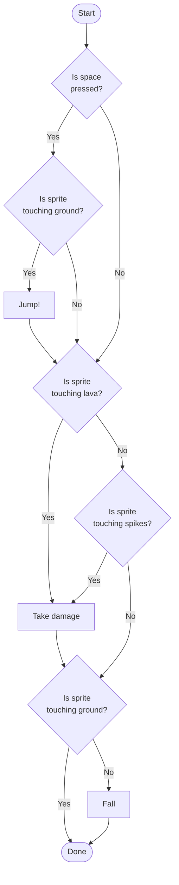
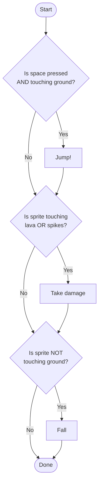

Imagine you're building a platformer game. Your sprite needs to:

1. **Jump** only when the player presses space **and** the sprite is touching the ground.
2. **Take damage** when the sprite touches lava **or** spikes.
3. **Fall** when the sprite is **not** touching the ground.

## Without Boolean Operators

Without `and`, `or`, and `not`, you have to use **nested `if` blocks** to check each condition separately. The flowchart gets big fast.

Notice the problems:

- We have to check **"touching ground?"** in **two different places** — once for jumping and once for falling.
- We have to check **lava** and **spikes** in **separate diamonds**, even though they do the same thing.
- The diagram is large and hard to follow.

## With Boolean Operators

With `and`, `or`, and `not`, each decision combines its conditions into **one diamond**. The flowchart becomes much simpler.

Same game logic — but now:

- **`and`** combines the jump conditions into one check.
- **`or`** combines lava and spikes into one check.
- **`not`** flips "touching ground" so we can ask "NOT touching ground?" directly instead of hiding the fall action inside an else branch.

Three operators, half the diagram.
