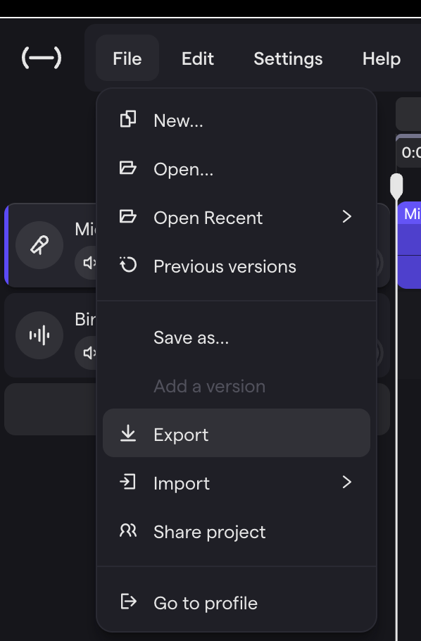
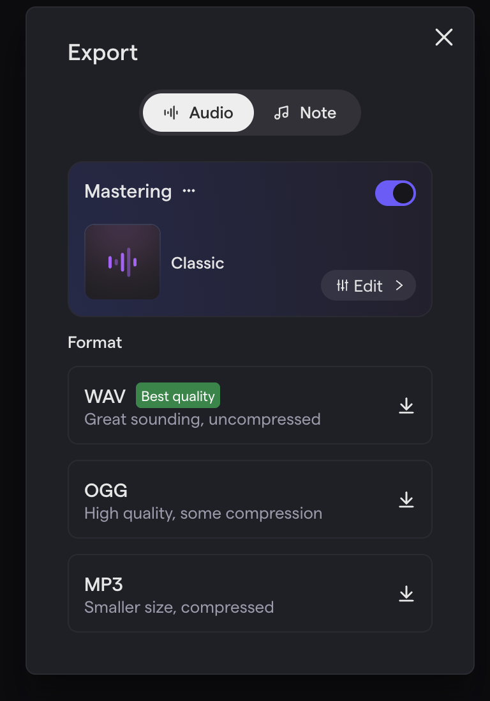
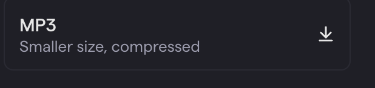

Wednesday, March 11th, 2026

{}

- I can finish editing my podcast episode.
- I can export my podcast as an MP3 file.
- I can submit my final episode as an audio file in CTLS.

{}

{}

If you still need to record or re-record any sections of your podcast, you have **up to 10 minutes** at the start of class to use the microphones. After that, microphones will be put away for the day.

Use this time wisely. If your recording is already complete, use these 10 minutes to continue editing.

{}

- [x] I have finished all recording.
- [x] Microphone and cables are put away properly.

{}

{}

{}

### Finish Editing

Use the remaining class time to finish editing your podcast. Your final episode should include:

- [x] Mistakes and long pauses cut out.
- [x] Intro music added.
- [x] Sound effects added where your script calls for them.
- [x] Smooth transitions between sections.

Listen to your episode from start to finish **at least once** before exporting. Make sure everything sounds clean and complete.

### Export as MP3

When your episode is ready, export it as an MP3 file:

1. Go to **File → Export**.
2. Make sure **Audio** is selected at the top.
3. Leave **Mastering** turned on (this will make your audio sound polished).
4. Scroll down and click the download button next to **MP3**.
5. Save the file somewhere you can find it (like your Downloads folder).
6. You can find the downloaded file by opening spotlight search (Command + Space) and typing "Downloads" or the name of your Soundtrap project.

  <figure style="border: 2px solid #ccc; padding: 1rem;">
    
    <figcaption>Go to File → Export.</figcaption>
  </figure>
  <figure style="border: 2px solid #ccc; padding: 1rem;">
    
    <figcaption>Make sure Audio is selected and Mastering is turned on.</figcaption>
  </figure>
  <figure style="border: 2px solid #ccc; padding: 1rem;">
    
    <figcaption>Click the download button next to MP3.</figcaption>
  </figure>

### Submit in CTLS

Once your MP3 is downloaded, submit it in CTLS:

1. Open the assignment in CTLS.
2. Click the **audio upload button** (it looks like a loudspeaker icon). This will let you upload an MP3 file directly, and it will show up with a play button so I can listen to your episode right in CTLS.
3. Upload your MP3 file.
4. Submit the assignment.

**Important:** Use the audio upload button — do not drag in the file or use the regular file attachment. The audio button is what gives your submission the built-in player.

{}

- [x] My episode is fully edited.
- [x] I exported my podcast as an MP3.
- [x] I submitted my MP3 in CTLS using the audio upload button.

{}
{}

{}

If you have submitted your episode, **listen to your classmates' podcasts**. As their episodes are submitted, you can play them directly in CTLS. Enjoy the shows!

{}
