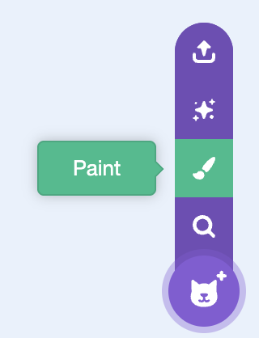
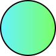
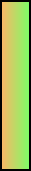
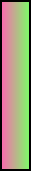



- I can create artwork in Scratch using primitive tools like lines, circles, and rectangles.
- I can write code in Scratch to allow a player to move.
- I can write code in Scratch to allow objects to move on their own.
  


Yesterday, we created the following artwork. Check yours... Use the `Paint a Sprite` tool to make them if needed...



1. A perfectly round ball. Hold down the shift key while drawing a circle.
1. A vertical rectangle for player 1's paddle.
1. A vertical rectangle for player 2's paddle.

| The Ball | Player 1's Paddle | Player 2's Paddle |
| --- | --- | --- |
|  |  |  |


1. I have confirmed all of the artwork is correct.
1. optional - I have created a background for the game.


The code for the ball is the following.
```scratch
when green flag clicked
go to x: (0) y: (0)
point in direction (pick random(0)  to (360))
forever
  move (10) steps
  if on edge, bounce
```

The code for one of the paddles is the following.
```scratch
when [w] key pressed
change y by (10)

when [s] key pressed
change y by (-10)
```

The code for the second paddle is the same, but with different keys.
```scratch
when [up arrow] key pressed
change y by (10)

when [down arrow] key pressed
change y by (-10)
```


1. I have confirmed all of the code is correct.





still working on this...
```scratch
when green flag clicked
say "This isn't ready yet!" for 2 seconds
hide
```



...
fgnfdgj
