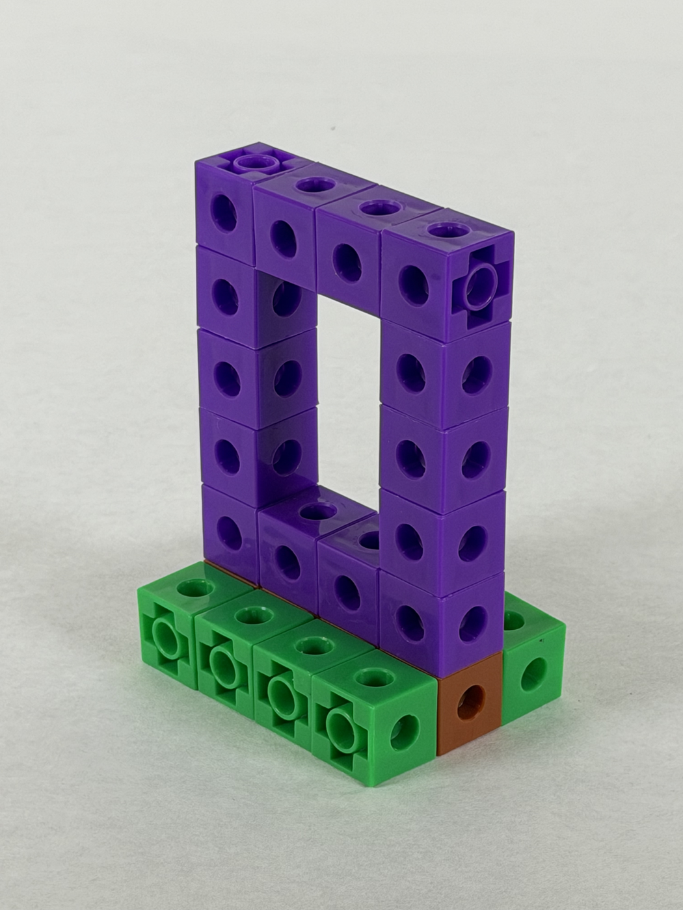

 **Tuesday, August 11th, 2026**

{}

## Objectives

- I can list the five characteristics of an isometric sketch.
- I can draw a cube on isometric graph paper by starting with an enclosing box.
- I can sketch an object with a corner cut off and with an opening cut all the way through it.
- I can tell the difference between construction lines and object lines in my own sketch.

{}

{}

## Warmup: The Isometric Sketching Resource

On your own, open the PLTW Isometric Sketching page and work through it at your own pace. This part is quiet and self-paced — we talk about it together afterward.

https://instructional-resources.s3.amazonaws.com/PLTW_Gateway/20071_DesignAndModeling/Exports/DM_IsometricSketching/index.html#/lessons/9ibTaqKQxK9-ILtAqzsUlnpU6b7E25ju


Scroll all the way to the bottom. There are two examples down there with arrow buttons — **Form 1** (11 steps) and **Form 2** (9 steps). Click all the way through both. That is where the actual method is.


As you read, write in your notebook:

- The five characteristics of an isometric sketch.
- One thing you are not sure about yet. We start the class discussion with these.

The five characteristics, straight from the resource — you should be able to say all five by the end of today:

1. The sketch appears three-dimensional because three sides are shown.
2. All principal dimensions (width, depth, and height) are in true proportion.
3. Width and depth lines are drawn at 30 degrees from horizontal.
4. All height lines are vertical.
5. The shapes of the object faces are distorted — a square face will not look like a square.

{}

### Checkpoint: Warmup

- [ ] I read the Isometric Sketching page.
- [ ] I clicked through both Form 1 and Form 2.
- [ ] I wrote the five characteristics in my notebook.
- [ ] I wrote down one thing I am not sure about.

{}

{}

{}

## Work Session: Box It, Then Cut It

Three sketches with Mr. Willingham, each harder than the last. Every one uses the same method: **box it, then cut it.** You never draw a complicated shape directly. You draw the plain rectangular box that would fit around it, then take material away.


Two kinds of lines today, and you need both. **Construction lines** are light — guides, some of which get erased. **Object lines** are heavy and dark — the real edges. Draw everything light first. Press hard on every line from the start and you have no way to fix a mistake.


### Sketch 1: A cube

Follow along on the document camera. Do not run ahead — we stop between lines.

Pick a point for the bottom corner. Draw one vertical height line. Draw the width and depth lines out along the 30-degree grid. Close up the top face and the two front faces.

Count grid spaces out loud with the class — 4, 4, 4. If the counts do not match, it is not a cube. Point the front of the object toward the lower-left corner of the paper.

### Sketch 2: Cut a corner off the cube

New sheet, new cube. This is Form 1 from the warmup, in miniature.

Draw a fresh cube in light construction lines. Mark where the cut lands on each edge. Connect the marks to make the new angled face. Trace only the real edges with heavy object lines.

Notice: cutting a corner off **creates a new face** you have to draw. Taking material away adds lines; it never just erases them. And the new face does not follow the grid lines — which is exactly why we drew the box first.

### Sketch 3: The portal

The hard one. The model is built from linking cubes and sits on the document camera. The opening goes all the way through, so you draw the inside of the tunnel too.

| Part | Size in cubes |
| --- | --- |
| Whole frame | 4 wide × 3 deep × 6 high |
| The opening | 2 wide × 4 high |
| Frame thickness | 1 cube, all the way around |

1. **Count it off the model.** Do not just copy the numbers above — count the cubes: 4 wide, 3 deep, 6 high. This is the step people skip.
2. **Pick your bottom-front corner** and point the front toward the lower-left. This one is 6 cubes tall, so start low on the page.
3. **Draw the enclosing box** in light construction lines: 4 spaces wide, 3 deep, 6 high. Count every edge. No portal yet — this is the block you are about to carve.
4. **Mark the opening on the front face.** In 1 space from the left edge, 1 from the right, up 1 from the bottom, down 1 from the top. What is left in the middle is the 2 × 4 opening. Keep it light.
5. **Push the opening through to the back.** From each corner of the opening, draw a construction line 3 spaces back along the depth direction. Connect them into a second rectangle. The hole is a box too, and it goes all the way through.
6. **Decide what you can actually see.** Looking into the tunnel, you can see two of its inside walls. The other two are hidden behind the frame. Look at the real model — then trace the two you can see and leave the hidden ones light.
7. **Trace the frame** with heavy object lines: the outside edges, the front edges of the opening, and the back edges you can see through it.
8. **Add the base** — a separate, shorter box underneath, 1 cube high and wider than the frame. Same method: box it, then trace it. Only once your frame is finished and clean.
9. **Shade it** if there is time. Hatch the faces getting less light, like Form 1 step 11. Bonus.


The mistake almost everybody makes: drawing height lines along the slanted grid lines. **Height lines are always vertical.** Width and depth are the ones that follow the 30-degree grid.


### Finished early?

- Sketch a cardboard box with a rectangular hole cut in one side — your own design, your own dimensions.
- Go back to the warmup page and sketch Form 2, the S-shaped part. Grid spacing is 1/4 inch. It is a real step up.

{}

### Checkpoint: Work Session

- [ ] I drew a cube on isometric graph paper.
- [ ] I drew a cube with a corner cut off it.
- [ ] I drew the portal, starting from a 4 × 3 × 6 enclosing box.
- [ ] My opening goes all the way through, and I drew the inside walls I can see.
- [ ] My construction lines are light and my object lines are heavy.

{}

{}

{}

## Closing: Compare and Check

Hold your portal sketch next to your neighbor's. Same object, same steps — so where do they look different, and whose reads more clearly as a solid object? Usually the difference is line weight, not accuracy.

Then check your own sketch against the model one more time:

- Are all of my height lines vertical?
- Did I count 4 wide, 3 deep, 6 high?
- Can somebody tell where the opening goes without me explaining it?

In your notebook, before you leave: **How is an isometric sketch different from a thumbnail sketch?**

Tomorrow: multiview sketching — three flat views a builder can measure from. The linking cubes stay out.

{}

## Standards

- [**MS-ENGR-II-1.1**](/design-modeling/description/#ms-engr-ii-1) — Communicate effectively through writing, speaking, listening, reading, and interpersonal abilities (an isometric sketch of the portal that a reader can understand without explanation).
- [**MS-ENGR-II-4.5**](/design-modeling/description/#ms-engr-ii-4) — Utilize an Engineering Design Notebook as a record of process (the five characteristics, three guided sketches, and the closing comparison in the notebook).
