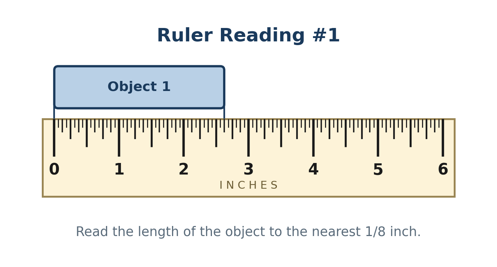
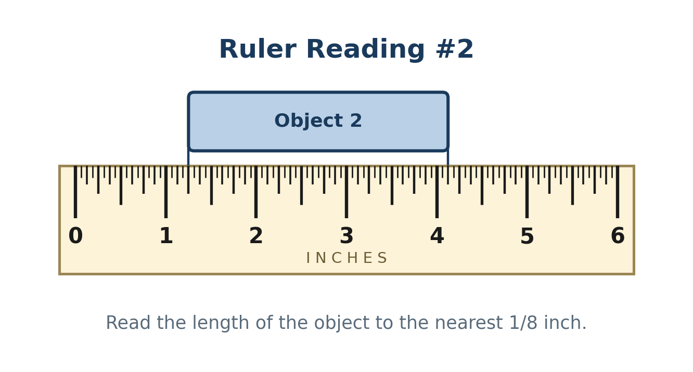
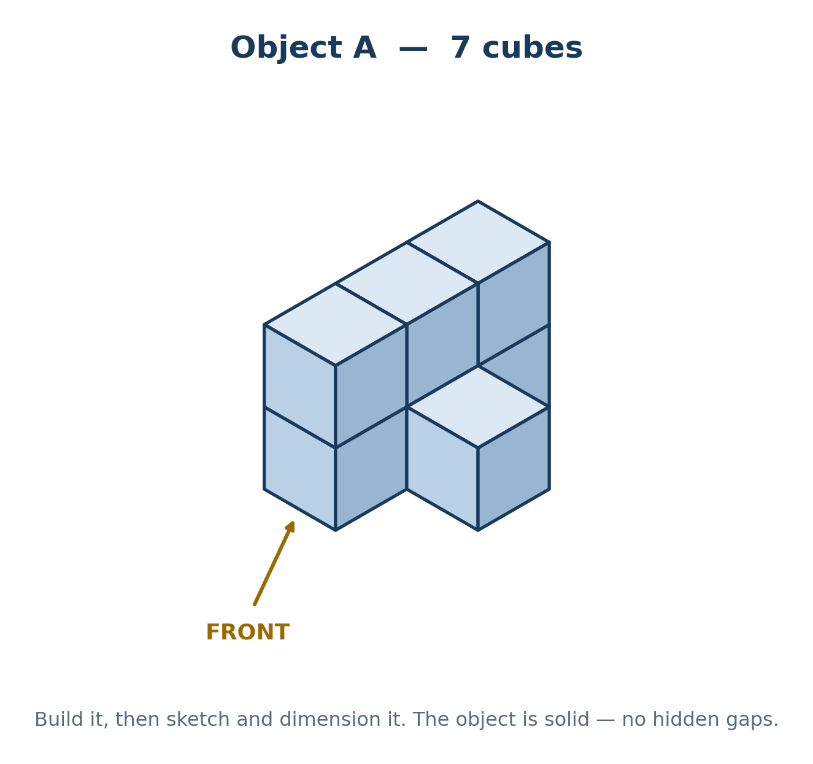
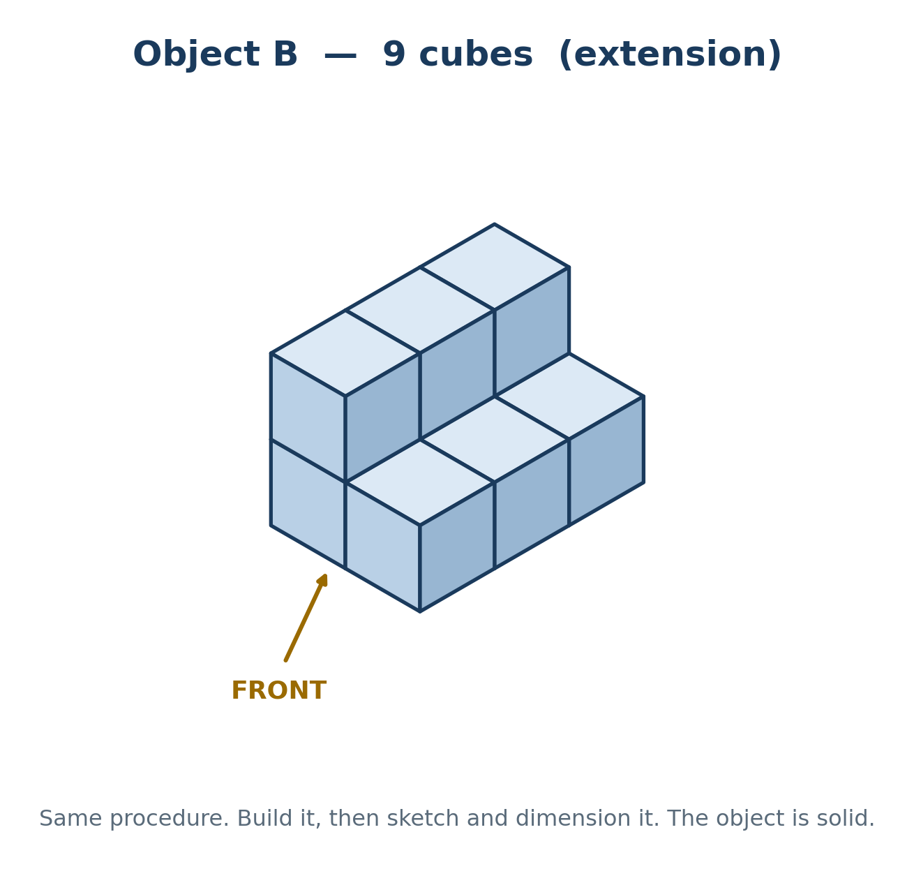
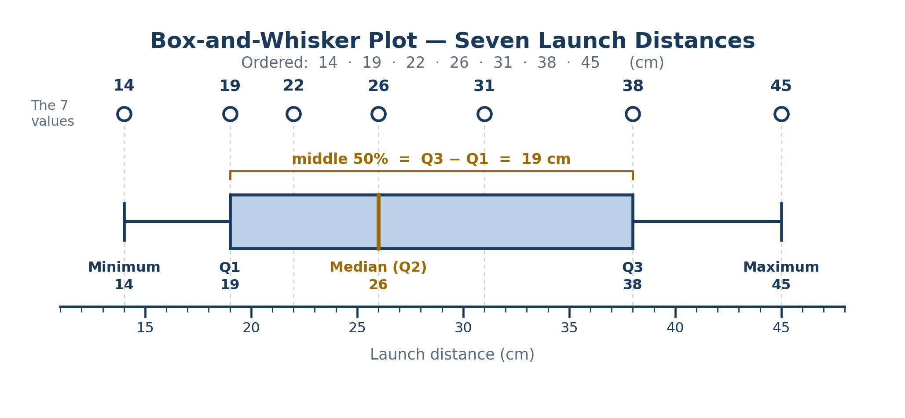

 **Friday, August 28th, 2026**

{}
On the Unit 1 Quiz (Friday, September 4) you are given an object, asked to draw a missing view, and then asked to dimension all three views. Today is the drawing half. Monday is the dimensioning half — and Monday you add dimensions to the very sketches you make today. Keep this page, and draw carefully.
{}

{}

## Objectives

- I can read a fractional-inch ruler and find Q1, Q2, and Q3 of a data set by hand.
- I can build a 7-cube object and sketch it in isometric plus TOP, FRONT, and RIGHT.
- I can get the three views aligned and labeled, with solid lines for visible edges and dashed for hidden ones.

{}

{}

## Warmup: Two Rulers and a Data Set

### Head today's page

New page in your Engineering Notebook. Three lines at the top, then one straight ruled line all the way across underneath:

- Line 1 — your full name · Period ___
- Line 2 — 8/28/2026
- Line 3 — Sketching Practice — Objects A and B

A headed, dated page is not busywork — "What belongs in an engineering notebook?" is a quiz question. An unheaded page is an unusable record.

### Three questions

Work alone first. Answers go in your notebook, numbered 1–3. We compare before we build anything.

1. **Ruler Reading #1** — read the length of the object to the nearest 1/8 inch and write it as a fraction, not a decimal.

   

2. **Ruler Reading #2** — before you answer, ask the question that catches almost everyone: *where is zero on this ruler?* If the object's edge is not sitting on the ruler's zero, you have to subtract.

   

3. **Quartiles.** Seven launch distances, in centimeters: **22 45 14 38 26 19 31**. Find Q1, Q2, and Q3 by hand. Show your ordered list. Then: how wide is the middle 50% of the data?

### Reminder — finding Q1, Q2, and Q3 by hand

1. Put the numbers in order, smallest to largest. Nothing works until you do this.
2. **Q2 is the median** — the middle number. With seven numbers in order, that is the 4th one.
3. **Q1 is the median of the numbers below Q2.** Do not include Q2 itself. That leaves three numbers, so Q1 is the middle one of those three.
4. **Q3 is the median of the numbers above Q2.** Again, leave Q2 out — again three numbers.
5. Always count what is in the half before you answer. An odd count means the quartile is one of your numbers. An even count means you add the two middle ones and divide by 2 — the quartile is then not in the list and may end in .5. Both are normal.

The middle 50% (the box on a box plot) is Q3 − Q1. The finished box plot for this data set is at the bottom of this page — check your answers against it.

{}

### Checkpoint: Warmup

- [ ] Page headed with name, date, and title, with a ruled line under it.
- [ ] Two ruler readings, as fractions.
- [ ] Q1, Q2, Q3, and the middle 50%, with the ordered list shown.

{}

{}

{}

## Work Session: Object A — 7 Cubes

It is built from 7 linking cubes and it is solid — no hidden gaps inside. The arrow on the picture tells you which face is the FRONT.

### Your sketch sheet — where each view goes

Each half-sheet has four grids: three square, one isometric.

- **Top left (square)** — TOP view
- **Top right (isometric)** — the isometric drawing
- **Bottom left (square)** — FRONT view
- **Bottom right (square)** — RIGHT view

That layout is not decoration — it puts TOP directly above FRONT and RIGHT directly beside FRONT, which is the alignment rule. One grid square per cube face. Use half the sheet for Object A; save the other half for Object B.

### Step by step

1. **Build it.** Match the picture exactly, then turn it so the FRONT face is facing you. Cube count: 7.
2. **Sketch the isometric** on the isometric grid — the whole object as it looks in the picture.
3. **Sketch TOP, FRONT, and RIGHT** on the square grids. One grid square per cube face, so the views come out the right size on their own.
4. **Check your alignment** before you call it done. Then label every view: TOP, FRONT, RIGHT.
5. **Glue or tape the finished sheet** into your notebook — top edge only, so it lies flat and still flips up.

### What makes a sketch correct — check all four

- TOP sits directly above FRONT — same width, lined up square for square.
- RIGHT sits directly beside FRONT — same height, lined up row for row.
- Solid lines for edges you can see; dashed lines for edges hidden behind the object in that view.
- Every view is labeled. An unlabeled view is not a drawing anyone can build from.


The test for a stray line: every vertical edge in your FRONT view should line up with an edge in the TOP view above it, and every horizontal edge should line up with one in the RIGHT view beside it. If a line has no partner in either neighbor, it should not be there.


### Coming Monday — these same sketches get dimensioned

On Monday you pull this sheet back out, measure Object A with a dial caliper, and add dimensions to the views you drew today. So two things matter right now:

- **Draw the views correctly.** You cannot dimension a wrong sketch — you would just be labeling a mistake.
- **Leave room around each view.** Dimensions go outside the object, in the space between views. If you jam each view into the corner of its grid, you have nowhere to put them.

**Do not add any numbers to your sketch today.** Today is shape only.

### Extension — Object B: 9 cubes

Finished Object A early? Object B is 9 cubes, solid, same FRONT arrow. Run the exact same procedure on the second half of your sketch sheet. Object B looks simpler than Object A — so look twice before you decide the RIGHT view is finished.

{}

### Checkpoint: Work Session

- [ ] Object A sketched: isometric + TOP, FRONT, RIGHT.
- [ ] TOP above FRONT, RIGHT beside FRONT — aligned square for square.
- [ ] Solid lines for visible edges, dashed for hidden ones.
- [ ] Every view labeled.
- [ ] Room left around each view for Monday's dimensions.
- [ ] Sketch sheet glued or taped into the notebook, top edge only.

{}

{}

{}

## Closing: Hard and Easy

Turn to your partner. Compare sketches and talk through two questions:

- **What was easy?** Which part came quickly — building it, drawing the isometric, getting the three views to line up?
- **What was hard?** Where did you get stuck, guess, or erase? Be specific: "deciding whether an edge should be dashed" is a useful answer; "all of it" is not.

Then write it in your notebook, under your sketches, two sentences in your own words:

- "The easiest part of sketching this object was ______ because…"
- "The hardest part was ______ because…"

Whatever you name as hard is what we drill on Monday — so be honest. Then: cubes fully apart and back in the bin.

### Warmup answer check — the box plot

The finished box and whisker plot for the seven launch distances in warmup question 3. All seven values are marked across the top so you can see where each one lands. Notice that 22 and 31 disappear inside the box — a box plot shows five numbers, not seven.

{}

## Standards

- [**MS-ENGR-II-1.1**](/design-modeling/description/#ms-engr-ii-1) — Communicate effectively through writing, speaking, listening, reading, and interpersonal abilities (an isometric plus three aligned, labeled views that a builder could work from).
- [**MS-ENGR-II-4.5**](/design-modeling/description/#ms-engr-ii-4) — Utilize an Engineering Design Notebook as a record of process (a headed, dated page with the warmup answers and the taped-in sketch sheet).
- [**MS-ENGR-II-5.4**](/design-modeling/description/#ms-engr-ii-5) — Use mathematical and scientific reasoning as evidence to support an engineering solution (reading rulers with the zero trap and finding quartiles by hand).
