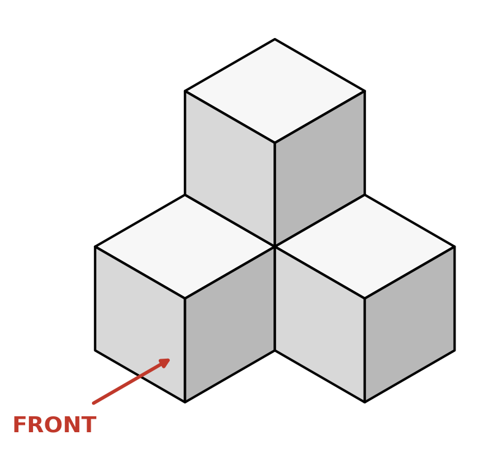

 **Monday, August 31st, 2026**

{}
The Unit 1 Quiz is Friday, September 4. Its largest item hands you an object, asks you to draw a missing view, and then asks you to dimension all three views. Friday you practiced the drawing half on Objects A and B. Today you run the whole thing on one small object — sketch it, then dimension it — so nothing on Friday is new.
{}

{}

## Objectives

- I can sketch a 4-cube object in isometric plus TOP, FRONT, and RIGHT.
- I can add a complete set of dimensions to my views: everything a builder needs, and nothing extra.
- I can decide which view gets zero dimensions — and say why.

{}

{}

## Warmup: Full Multiview Sketch

New page in your Engineering Notebook: name and period, 8/31/2026, title **Dimensioning Practice — 4-Cube Object**, ruled line underneath.

Today's object is built from 4 linking cubes, it is solid, and the arrow marks the FRONT.

Grab a sketch half-sheet and run the full Friday procedure — this time without the step-by-step walkthrough:

1. **Build it** from the picture and face the FRONT toward you. Cube count: 4.
2. **Sketch the isometric**, then TOP, FRONT, and RIGHT on the square grids — TOP above FRONT, RIGHT beside FRONT, one grid square per cube face.
3. **Label every view** and check alignment before you call it done.


Walk around the object before you decide a view is finished. Look at it from the right side and ask what you cannot see from there. Whether a hidden line shows up depends on which face you chose as the FRONT — a concave corner that is a dashed line from one direction can be a plain solid edge from another. If you and your neighbor picked different fronts, compare: where did the hidden line go?


{}

### Checkpoint: Warmup

- [ ] Page headed with name, date, and title, ruled line under it.
- [ ] 4-cube object sketched: isometric + TOP, FRONT, RIGHT, aligned and labeled.
- [ ] Every hidden edge is dashed, every visible edge is solid.

{}

{}

{}

## Work Session: Now Dimension It

First, a one-minute measurement: take a dial caliper and measure one cube. Read it properly — big number from the scale, small number from the dial. You should get **0.750 in.** Every dimension you write today is some multiple of that number, and your sketch must say somewhere: **"Measurements are in inches."**

A dimensioned sketch is build instructions: a person who has never seen the object must be able to make it from your paper alone. Add dimensions to your three views — dimension lines with arrowheads, extension lines with a small gap from the object, numbers outside the views in the space between them. Include every measurement a builder needs… and then **stop**.

### The six errors we grade for

1. A dimension that repeats one already given
2. A dimension a builder could figure out from the others
3. A dimension placed on a hidden (dashed) line
4. Dimensions inside the object outline
5. Dimensions pushed out to the border instead of between the views
6. Dimension or extension lines that cross each other

The question to ask before every number: **does the builder already know this?** If yes, leave it off. When a view shows nothing new, that view gets zero dimensions — count how many yours needs today.


Rule of thumb: every width, every height, and every depth gets written **once**, in the view where it is clearest. Once you have covered all of them, you are done — no matter how empty one of the views looks.


### Finished and checked?

Pull Friday's sheet back out and dimension **Object A** — the promise from Friday's lesson. Same rules, bigger object. Object B after that, if you are flying.

{}

### Checkpoint: Work Session

- [ ] One cube measured with the caliper: 0.750 in.
- [ ] All three views dimensioned — nothing missing, nothing extra, none of the six errors.
- [ ] Unit of measure stated on the page.

{}

{}

{}

## Closing: Trade and Grade

Swap notebooks with your partner. Hunt their sketch for one violation of the six errors — or, if it is clean, try to name a dimension they left off that a builder would need. Tell them what you found, fix your own, and write one sentence under your sketch: **"The dimension I almost got wrong was ______ because…"**

Cubes apart and in the bin, calipers closed and back in the case.

Tomorrow: Lesson 2 begins — solid modeling in Tinkercad. Your sketching skills go digital. A quiz study guide comes home with you tomorrow. Friday, September 4: Unit 1 Quiz. Paper only — ruler, pencil, calculator. Notebook to study from, not to use.

{}

## Standards

- [**MS-ENGR-II-1.1**](/design-modeling/description/#ms-engr-ii-1) — Communicate effectively through writing, speaking, listening, reading, and interpersonal abilities (a dimensioned sketch that someone who has never seen the object could build from).
- [**MS-ENGR-II-2.4**](/design-modeling/description/#ms-engr-ii-2) — Identify, select, and use appropriate tools and machines for specific tasks (measuring the cube with a dial caliper to get the 0.750 in. unit every dimension is built from).
- [**MS-ENGR-II-5.4**](/design-modeling/description/#ms-engr-ii-5) — Use mathematical and scientific reasoning as evidence to support an engineering solution (a complete, non-redundant dimension set, with a reason for every number left off).
