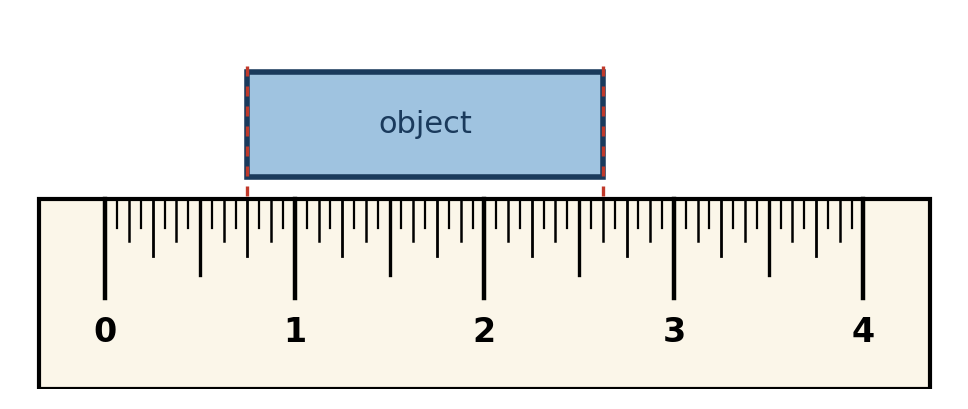

 **Wednesday, September 2nd, 2026**

{}

## Objectives

- I can read a ruler with the zero trap.
- I can continue Activity 2.1 in myPLTW, right after Tinker Time!
- I can build a 3D model from a multiview sketch, resize it two ways, and cut a hole.

{}

{}

## Warmup: One Ruler, No Mercy

Head a new notebook page: **9/2/2026 · "Tinkercad — 2D to 3D"**. Read the object's length **to the nearest 1/8 inch** as a fraction. First question: *where is the left edge?* Answer at the bottom of this page.

{}

### Checkpoint: Warmup

- [ ] Warmup ruler reading written as a fraction and checked.

{}

{}

{}

## Work Session: Activity 2.1 in myPLTW


**The instructions are in myPLTW, not on this page.** Clever → **myPLTW** → **Design and Modeling** → **Lesson 2** → **Activity 2.1: Taking Modeling to Another Dimension**. Use the section list on the left. The circle next to each section shows your progress: empty = not started, partly filled = in progress, check mark = done.


**Start where you stopped yesterday.** Look at **Tinker Time!** in the sidebar. No check mark? Finish it first. Check mark? Click **Get Converted: 2D to 3D**.

Work down these three sections, in order. Follow the steps in myPLTW; here is what to watch for:

1. **Get Converted: 2D to 3D.** You get TOP, FRONT, and RIGHT views — build the object they describe. This is Friday's Question 5 **in reverse**.
2. **Sizing It Up.** Resize two ways: drag the handles, or type exact numbers. Answer the notebook prompt. (Tinkercad uses **millimeters** here — always state your unit.)
3. **'Hole Other Level.** Striped shapes are **holes**. Cylinder into box, **align**, then **group**. Check from two views before you group.


**Same habit as sketching:** check every change from at least two views. Centered from the top can be floating from the front. Trust views, not vibes.



**Notebook rule — every day, every activity:** every reflection question, Check Your Understanding, and notebook prompt in myPLTW must **also be written by hand in your Engineering Notebook** — question and answer. Typing it into the platform does not count. Your notebook is the graded record.


{}

### Checkpoint: Work Session

- [ ] Tinker Time! has a check mark.
- [ ] 2D-to-3D build done and checked against the example.
- [ ] Both resize methods tried; notebook prompt answered.
- [ ] Hole cut, aligned, and grouped.
- [ ] Every myPLTW reflection question and Check Your Understanding copied into the Engineering Notebook.

{}

{}

{}

## Closing

Two sentences in your notebook: **"What can a 3D model tell a designer that a 2D sketch cannot? What can the sketch still do better?"** Then log out.

**Study guide tonight:** read *Multiview sketching* and *Dimensioning*, and do the sketch-at-home object (it has one hidden line). Quiz is Friday.

Thursday: name tag design challenge + last quiz review. Friday: Unit 1 Quiz — ruler, pencil, calculator.

### Warmup answer check

Left edge is on **3/4**, not zero. Right edge is 2-5/8. Length = 2-5/8 − 3/4 = **1-7/8 in.** If you got 2-5/8, you read only the right edge — that is Friday's trap.

{}

## Standards

- [**MS-ENGR-II-1.1**](/design-modeling/description/#ms-engr-ii-1) — Communicate effectively through writing, speaking, listening, reading, and interpersonal abilities (reading a multiview sketch and building the object it describes).
- [**MS-ENGR-II-2.4**](/design-modeling/description/#ms-engr-ii-2) — Identify, select, and use appropriate tools and machines for specific tasks (choosing typed dimensions over dragged handles when a size must be exact; using hole shapes, align, and group).
- [**MS-ENGR-II-5.4**](/design-modeling/description/#ms-engr-ii-5) — Use mathematical and scientific reasoning as evidence to support an engineering solution (reading a ruler with the zero offset; sizing a model to exact millimeter values).
