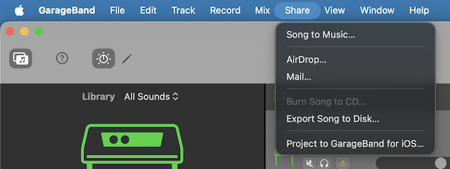
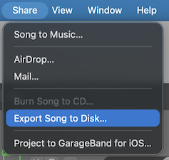
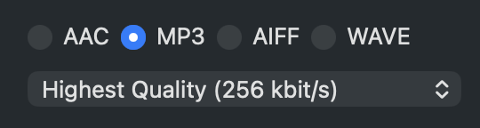

Friday, March 13th, 2026



Login to Clever.com and access Edpuzzle. Watch the video reviewing the sound design process so far. It is roughly five minutes in length.

**After the video**, make sure your GarageBand project is setup according to the instructions in the video.



- [x] I have watched the Edpuzzle video.
- [x] I have set up my GarageBand project with the Rocket League video (download below if needed)
- [x] I have added the Balloon Pop sound.







#### The Files (if you need them)

Download the file **if you need**. You downloaded it yesterday hopefully, so maybe skip this.

Then make a new GarageBand project. The video file can be dragged into GarageBand. Then we can begin.

Download this [ZIP archive](https://cdn.mrwillingham.com/RocketLeague.zip). Extract the archive to access the files within.

### Plugins to Try

#### From the Video

1. Reverb => Space Designer
   - This one can vary a lot. Try out different presets to see how they affect your sound.
2. Modulation => Flanger
   - This will add a sweeping, whooshing effect to your sound. It is often used on guitar and synth sounds.
3. Distortion => Bitcrusher
   - This will add a crunchy, digital distortion to your sound.

#### Some New Ones to Try

1. Delay => Echo
   - This one is obvious.
2. Specialized => SubBass
   - This will add a low rumble to your sound.
3. Modulation => Chorus
   - This will add a shimmering, doubling effect to your sound.

---

# Share It

This is optional, but if you make something even half interesting, share it.

Export it as an MP3 file. Then [turn it in here](https://forms.cloud.microsoft/r/BvaQ6jGvPy)

1. Click the "Share" menu in GarageBand.
2. Choose "Export Song to Disk..."
3. Choose "MP3" as the format and export your file.

> Click the share menu.

> Choose "Export Song to Disk..."

> Choose "MP3" as the format and export your file.

# Examples

<video controls src="https://cdn.mrwillingham.com/Example1.mov"></video>


