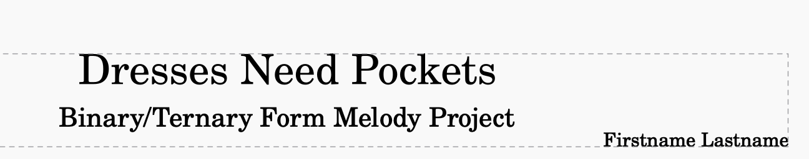

Students stop reading other people's music and write their own. Every concept lives on [Melody and Form](/music-technology/reference/melody-and-form/); every MuseScore move lives on [MuseScore Basics](/music-technology/reference/musescore-basics/). The summative piece is Project Day 4.

## Schedule

| Project Day | Plan |
| ----------- | ---- |
| 1 | **A Minor and the Tonic** — the A minor scale, then an eight-measure melody that ends on the tonic with a long note |
| 2 | **Binary and Ternary** — an eight-measure A section; copy, paste, vary into B; paste A back for ternary |
| 3 | **Tonic, Dominant, and Cadence** — number both scales; write a binary piece that pauses on the dominant and ends on the tonic |
| 4 | **One Piece, One Period** — the summative: binary or ternary, sections of at least eight measures, repeat signs, a tonic–dominant bass line, MP3 and PDF |
| 5 | **Listening Party** — every piece plays on the big speakers |

## Project Day 1: A Minor and the Tonic

New score: Piano, **A minor**, 4/4, **12** measures, an original title, your name as composer.

**Measures 1–4:** the A minor scale up and down in quarter notes (A B C D | E F G A | A G F E | D C B A). Same white keys as C major, and it should not sound like C major at all.

**Measures 5–12:** an eight-measure melody. Only notes from the scale; do not copy the scale; mix rhythms; mostly steps with occasional skips; write four measures and reuse the material; **end on A, half note or longer**. Play the scale and stop on G to hear why the ending matters.

Turn in: MP3 and PDF ([Turning In Work](/music-technology/reference/turning-in-work/)).

## Project Day 2: Binary and Ternary

New score: Piano, C major, 4/4, 8 measures, original title.

**Section A (measures 1–8):** only **C, D, E, G, A**. Two four-measure phrases — a question that ends off C and an answer that ends on C, half note or longer. Everything else today is a copy of these eight measures, so fix mistakes here first.

**Section B:** [copy, paste, vary](/music-technology/reference/musescore-basics/#copy-paste-vary) into measures 9–16. Change at least two things; keep the five notes, the two phrases, four beats per measure. **End B on G** so it stays unresolved. Measures 1–16 are **binary**.

**Ternary:** add eight measures, paste A into 17–24. Play 1–16 and stop, then play 1–24. Same notes, one paste, and only one of them sounds finished. Nothing is submitted; the score is scratch work.

## Project Day 3: Tonic, Dominant, and Cadence

Scratch score titled **Scales**: C major in measures 1–4, A minor in 5–8, both numbered 1–7–1 ([Melody and Form](/music-technology/reference/melody-and-form/#scales)). Play 5 then 1 and hear the pull.

Then the real score: Piano, C major key signature, 4/4, 8 measures, original title. Pick a home — C major (tonic C, dominant G, bright) or A minor (tonic A, dominant E, darker). Same five notes either way.

**Section A:** only C, D, E, G, A; two phrases; measure 4 ends on anything except the tonic; **measure 8 ends on the dominant, held long** — the comma.

**Section B:** copy, paste, vary into 9–16. **Measure 16 ends on the tonic, on a whole note** — the period. Measure 16 starts as a copy of measure 8, so play it on the dominant first, then change that one note. Binary form, saved, nothing submitted.

## Project Day 4: One Piece, One Period

One complete piece, start to finish, in one class period. This is the summative.

### Requirements

- **Form:** binary (A B) or ternary (A B A).
- **Section length:** every section at least **8 measures** — binary at least 16, ternary at least 24.
- **Notes:** only the seven letters A–G, any octave. **No sharps, no flats.** A ♯ or ♭ on the score means something went wrong.
- **Rhythms:** sixteenth through whole notes, mixed.
- **Repeat signs:** wrap the **entire form** — start repeat at the first measure, end repeat at the last — so the whole piece plays twice.
- **Melody:** one note at a time on the top staff. No chords.
- **Bass line, required:** a bass staff under the melody using **only the tonic and the dominant** — C and G in C major, A and E in A minor. Low, steady, one note per measure is plenty. Dominant at the halfway point, tonic in the last measure.
- **Title block:** an original title, the subtitle **Binary/Ternary Form Melody Project**, and your name.

Dynamics, articulations, ornaments, tempo markings: optional and welcome, not graded.

### Advice worth taking

- Pick a home note first and end on it, long.
- Make B actually different — at least two changes.
- Melody first, bass line after. Two notes to choose from means the bass line is the fast part.
- Ternary: copy and paste A for the return, bass line included. That is what ternary form is.
- Eight measures by the halfway point or you are behind.

### Turn in

MP3 **and** PDF, both named with your title, uploaded to CTLS. The MP3 is what it sounds like; the PDF is the notes, repeat signs, and form as written. One file to hear it, one to see it.

## Project Day 5: Listening Party

Five minutes to export and submit anything still missing, then **log off, screens down, headphones off**. Every piece plays on the big speakers start to finish. Listen for the moment the section changes, the bass line leaning on the dominant and coming home, and one thing the composer did that you did not think of. Every piece gets the same quiet room.

## Checkpoints

**Day 1**

- [ ] Measures 1–4 hold the A minor scale and play back clean.
- [ ] Measures 5–12 use only scale notes, more than one rhythm, and end on a long A.
- [ ] MP3 and PDF are both in CTLS.

**Day 2**

- [ ] A uses only C, D, E, G, A; question ends off C, answer ends on C.
- [ ] B is a varied copy that ends on G.
- [ ] 24 measures, A B A, played back to back against the binary version.

**Day 3**

- [ ] Both scales written and numbered.
- [ ] Measure 8 on the dominant, held; measure 16 on the tonic, whole note.

**Day 4**

- [ ] Form, section length, notes, rhythms, repeat signs, bass line, title block — all seven requirements.
- [ ] MP3 and PDF uploaded.

**Day 5**

- [ ] I listened to every piece and can name one specific thing another composer did.

## Teacher Notes

- Day 1 is also where the three turn-in rules get taught; the lesson sends students to check the previous day's submission before starting.
- Days 2 and 3 are scratch work. Students who lose them lose nothing; the summative is written fresh on Day 4.
- Post an example score with a tonic–dominant bass line, and its recording, on CTLS for Day 4.
- The note-reading quiz follows this project; its scope is on [Note Reading Practice](/music-technology/reference/note-reading-practice/#the-quiz).
