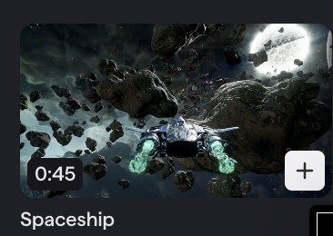
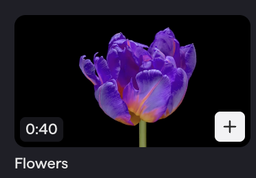

The summative for the sound-for-screen unit. Students have already scored [Urban Runner](/music-technology/projects/urban-runner/) together, set up microphones ([Recording Setup](/music-technology/reference/recording-setup/)), and practiced the effects ([Sound Design](/music-technology/reference/sound-design/#effects)). Now they do it alone, with a sound they recorded themselves.

## Schedule

| Project Day | Plan |
| ----------- | ---- |
| 1 | **Build** — read the requirements and rubric, pick a clip, set up, build the soundtrack |
| 2 | **Finish and Submit** — self-score against the rubric, fix the lowest row, export as video, upload |
| 3 | **Share and Vote** — watch six classmates, rank a top four |

## Pick One Clip

All three are in Soundtrap's **Video Library**.

| Spaceship (0:45) | Futuristic City (0:34) | Flowers (0:40) |
| :---: | :---: | :---: |
|  |  |  |

## Set Up

1. Soundtrap → **New Project** → the video option → **Video Library** → your clip.
2. Name the project **Sound Design Project**.
3. Drag in your **found sound** — the recording you turned in on CTLS. Turned it in late? You can still submit it for partial credit; you still need it here.

## Requirements

1. **Found sound.** At least one sound you recorded yourself.
2. **Effects.** Change your sounds with a combination of effects.
3. **Automation.** A volume curve on at least one track.
4. **Sound throughout.** Sound or music from the first frame to the last. No dead silence.
5. **Sync.** Every key moment on screen lands on a prominent sound.

Any sounds and music loops from the Soundtrap library may be used as well.

## Effects to Try

Reverb (small room, hall, cave, outer space), delay (short time + high feedback is a sci-fi charge-up), EQ (cut highs to muffle, cut lows to thin, boost lows for a heavy hit), distortion, modulation, pitch shift (drop your found sound low to make it big). Stack two or three on one track; change the order and listen again. Definitions on [Sound Design](/music-technology/reference/sound-design/#effects).

## Automation

Anything that moves toward or past the camera gets a **curve**, not a straight line — the same as the Urban Runner vehicles. Ideas: the ship or an asteroid flying past, the plane crossing the skyline, a swell as the flower opens. See [the automation curve](/music-technology/reference/sound-design/#the-automation-curve).

## Rubric

Each row is 20 points. Total 100.

| Requirement | 20 — Full | 10 — Partial | 0 — Missing |
| --- | --- | --- | --- |
| **Found sound** | My own recording is in the project and you can hear it | It is there but buried or hard to hear | No found sound |
| **Effects** | Two or more different effects clearly change my sounds | One effect, or effects you cannot really hear | No effects |
| **Automation** | A volume curve on at least one track matches movement on screen | Automation is a straight line or does not match the picture | No automation |
| **Sound throughout** | Sound or music from the first frame to the last | One or two silent gaps | Mostly silent |
| **Sync** | Every key moment lands on a prominent sound | Some key moments are missed or noticeably late or early | Sounds do not line up |

## Project Day 2: Finish and Submit

Play the whole project once and score yourself on each row: 20, 10, or 0. Anything below 20 is the to-do list; start with the lowest row.

- **No found sound?** Use a take from your Found Sounds project, or record one now on your phone.
- **Found sound buried?** Turn it up or turn the other tracks down.
- **Gap of silence?** Stretch the ambience or add a music loop underneath.
- **Late hit?** Zoom in and nudge until it lands on the frame.

Stop editing with 10 minutes left. Export as a **video** and upload it to the CTLS discussion ([Turning In Work](/music-technology/reference/turning-in-work/#soundtrap-export-a-video)). A Soundtrap link or an MP3 is not a submission.

## Project Day 3: Share and Vote

[Peer Voting](/music-technology/reference/peer-voting/): watch your six, judge them against the five rubric rows, rank a top **four**. Points 10 / 6 / 3 / 1. You only need four of your six posted to vote.

## Checkpoints

**Day 1**

- [ ] I read all five requirements and the rubric, and picked my clip.
- [ ] My found sound is in the project and audible.
- [ ] At least two effects, at least one volume curve, sound throughout, every key moment on a sound.

**Day 2**

- [ ] Every row of my self-score is a 20, or as close as I can get.
- [ ] My video is exported and uploaded.

**Day 3**

- [ ] My video is posted.
- [ ] I watched my six and submitted the form once with 1, 2, 3, 4.

## Teacher Notes

- The found-sound homework (record one interesting sound on your phone, upload to CTLS) is assigned on the microphone day, two to three days before Project Day 1.
- Day 2 early finishers can start the podcast brainstorm ([Podcast](/music-technology/projects/podcast/) Project Day 1).
- Exit tickets: *Which moment in your clip needs the biggest sound, and what will you use?* (Day 1); *Which row did you improve today and what did you change?* (Day 2); *What did your number 1 pick do that you wish you had done?* (Day 3).
