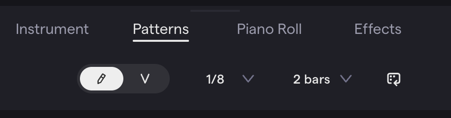

## Parts of the Drum Kit

- **Kick (bass drum)** — the deep, low sound that anchors the beat. Usually beats 1 and 3.
- **Snare** — the sharp crack that provides the **backbeat**. Usually beats 2 and 4.
- **Hi-hat** — a pair of cymbals that keep a steady rhythm. **Closed** is tight and crisp; **open** is sloshy and sustained.
- **Crash cymbal** — accents, often at the start of a new section.
- **Ride cymbal** — a steady-rhythm role like the hi-hat, with a different tone.
- **Toms** — pitched drums, used in fills.
- **Accessories** — cowbell, tambourine, claps, shakers.

A **groove** is what you get when these lock together. The next time you listen to a song, pick out the kick, snare, and hi-hat one at a time.

## MIDI

**MIDI** (Musical Instrument Digital Interface) is a way for electronic instruments and computers to communicate. It is **instructions**, not sound — which note, when, and how hard (**velocity**). A MIDI controller or a pattern grid sends those instructions to the drum sounds in Soundtrap.

Controller types: **pad** (a grid of squishy buttons), **keyboard** (looks like a piano), **pedal** (played with your feet), and **drum** (a plastic kit played with sticks).

## Patterns Beatmaker

Soundtrap's built-in drum machine. Each row is a drum sound and each column is a moment in time. Click a box and that drum plays at that moment.



From a new project click **Patterns Beatmaker** in the middle of the screen, or add a new track and choose the pattern option.


Change the rhythm from **1/16** to **1/8** notes (eight steps per measure) and the length to **2 measures** — 16 steps, two per beat.



Click boxes to turn steps on and off. Press play to hear it loop. Work one drum at a time.



Extras: add a crash or open hi-hat row, switch to 1/16 for finer control, extend to 4 measures, or use **velocity** mode to vary how hard each hit lands.

## The Rock Beat

Steady hi-hat, kick on beats 1 and 3, snare on 2 and 4. Sixteen steps, two per beat; **X** means click that box.

| Step | 1 | 2 | 3 | 4 | 5 | 6 | 7 | 8 | 9 | 10 | 11 | 12 | 13 | 14 | 15 | 16 |
| --- | --- | --- | --- | --- | --- | --- | --- | --- | --- | --- | --- | --- | --- | --- | --- | --- |
| Closed Hi-Hat | X | X | X | X | X | X | X | X | X | X | X | X | X | X | X | X |
| Kick | X | | | | X | | | | X | | | | X | | | |
| Snare | | | X | | | | X | | | | X | | | | X | |
| Measure | 1 | - | - | - | - | - | - | - | 2 | - | - | - | - | - | - | - |

Hi-hat on every step; kick on 1, 5, 9, 13; snare on 3, 7, 11, 15.

## Fills

A **fill** is a short phrase that adds interest and marks the end of a section. In a 16-step pattern it normally lives in the last four steps. Two ways to make one:

**Add sounds** — toms and a crash in steps 13–16:

| Step | 1 | 2 | 3 | 4 | 5 | 6 | 7 | 8 | 9 | 10 | 11 | 12 | 13 | 14 | 15 | 16 |
| --- | --- | --- | --- | --- | --- | --- | --- | --- | --- | --- | --- | --- | --- | --- | --- | --- |
| Closed Hi-Hat | X | X | X | X | X | X | X | X | X | X | X | X | X | X | X | X |
| Kick | X | | | | X | | | | X | | | | X | | | |
| Snare | | | X | | | | X | | | | X | | | | X | |
| Tom | | | | | | | | | | | | | X | X | X | X |
| Crash | | | | | | | | | | | | | X | | | |

**Take away or move sounds** — the hi-hat stops after step 13 and the last snare moves from 15 to 16:

| Step | 1 | 2 | 3 | 4 | 5 | 6 | 7 | 8 | 9 | 10 | 11 | 12 | 13 | 14 | 15 | 16 |
| --- | --- | --- | --- | --- | --- | --- | --- | --- | --- | --- | --- | --- | --- | --- | --- | --- |
| Closed Hi-Hat | X | X | X | X | X | X | X | X | X | X | X | X | X | | | |
| Kick | X | | | | X | | | | X | | | | X | | | |
| Snare | | | X | | | | X | | | | X | | | | | X |

Combine both. Whatever you do, a listener should still hear the rock beat underneath.

## Four on the Floor

The kick plays on **every** beat — 1, 2, 3, 4. House, disco, rock, pop. Snare on 2 and 4, hi-hat on eighth notes.

## Recording a Live Drum Track

Play the drums in instead of clicking a grid.



**Add track → Drums & Machines → Patterns**, then click the **Instrument** tab.


Check that the record-enable button on the track is lit.


Use the **MIDI controller** or the **assigned computer keys** to trigger the drum sounds.


`cmd + space` (or the Record button) to start; `space` to stop. Record one drum per track, four measures at a time.



Sharing a controller with a table-mate: each of you works in **your own project on your own computer**; swap the controller between tracks so both of you use both input methods.

## Quantization

When you play a beat by hand, your hits land a little early or late. **Quantization** snaps every recorded note to the nearest point on a grid. It is **rounding for musical timing**: a snare at beat 2.07 rounds down to 2, one at 1.94 rounds up to 2.

The grid value is the place value you round to:

| Grid | Rounding | Use for |
| --- | --- | --- |
| 1/4 note | Coarsest — every note jumps to the nearest beat | Kick and snare on the beat |
| 1/8 note | Finer | Hi-hats and most grooves |
| 1/16 note | Finest — keeps more human feel, also keeps more sloppiness | Busy parts |

**Match the grid to what you played.** Quarter-note kick and snare need a 1/4 grid; a 1/16 grid leaves the mistakes where they are. An eighth-note hi-hat needs a 1/8 grid; a 1/4 grid drags every off-beat hit onto the beat and erases half of them. Quantization is just note values — see [Music Reading 101](/music-technology/reference/music-reading-101/#note-values).

### How to quantize in Soundtrap

1. Select the recorded track and click **Piano Roll**.
2. Select the notes — click and drag, or click one and `cmd + A`.
3. **Right-click → Quantize** and choose a subdivision.
4. Listen. It should sound tighter.

You can also hover over a region, click **Edit**, then **Quantize**, without opening the Piano Roll.
