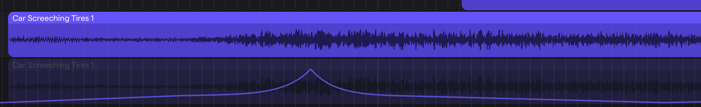

Every scene in film, TV, and games is built from the same handful of ideas. This page is the toolbox; the project pages say what to build.

## Approved Sounds

Use only sounds found inside Soundtrap's library, or files Mr. Willingham posts on CTLS. Do not go to freesound.org or any other sound site; they are not approved resources. The Freesound sounds inside Soundtrap are fine — they have been curated.

## Sync Points and Ambience

Sync point
: A moment on screen a sound must land on **exactly**. If you have to wonder whether it lined up, it didn't. Nudge it.

Ambience
: The continuous background bed that makes a scene feel alive — city, traffic, crowd, wind, birds. Real silence sounds like a mistake, like the video did not load. Turn the bed down until you stop noticing it; that is the right level.

Diegetic / non-diegetic
: A **diegetic** sound exists in the character's world (the truck engine). A **non-diegetic** sound does not (the coin chime). You hear it; the character never does.

Original sound effects do not have to sound like the real thing. A coin spinning in mid-air makes no sound at all; you are inventing what it sounds like. If it reads as *you got something*, it works.

## The Automation Curve

Anything that moves toward or past the camera gets **volume automation shaped like a curve**: low and flat for a long time, a fast rise into the moment it passes, then a fast drop.

**Why a curve, not a line.** The **inverse square law**: sound spreads out in every direction, so at double the distance the same sound covers four times the area and you get one quarter of the energy. An approaching truck stays quiet for most of its trip and gets loud fast at the very end. A straight ramp sounds fake.

**Bonus: the Doppler effect.** Pitch drops as a vehicle passes — higher coming toward you, lower going away. Volume automation will not do that; a pitch shift after the pass will.

### How to automate in Soundtrap

1. On the track, open **Automation** and choose **Volume**.
2. Add a point before the object enters, one where it passes, one after it leaves.
3. Drag the points into the curve shape. Play it back; if it fades in evenly, the curve is wrong.

## Foley

Foley is sound effects performed and placed by hand — footsteps, jumps, cloth, props.

A footstep recording is **one long walk** at somebody else's pace. Dragging the whole file onto the timeline will not line up and cannot line up. Chop it:

1. Drag the file onto its own track and zoom in until you see the waveform. Each step is a **spike**.
2. **Split** (`cmd + T`) just before and just after one spike. That spike is one step.
3. Copy it. Paste a step on each frame where a **foot hits the ground** — not when the leg swings or lifts.
4. Chop out three or four different steps and alternate them, vary the volume slightly, and match the pace on screen. Identical copies sound like a machine.

A jump is **two** sounds: a takeoff (scuff, push, grunt) and a landing (heavier than a step — a running step turned up, or doubled). The landing is the one the audience feels.

## Effects

Click **Effects** on a track → **Add effect**. Turn it off and on to hear the difference. Change one setting at a time.

Reverb
: Puts the sound in a space — small room, big hall, cave, outer space. Too much on everything sounds muddy.

Delay
: Echoes. Short time is a quick double; long time is canyon echoes. **Feedback** is how many echoes. Short time + high feedback makes a sci-fi charge-up.

EQ
: Turns low, middle, and high frequencies up or down. Low = rumble, middle = body, high = sparkle and hiss. Cut the highs to muffle; cut the lows to thin it out; boost the lows for a heavy hit.

Distortion
: Grit and crunch. It also makes things louder — turn the volume down to compare fairly.

Modulation
: Sounds that move and wobble: chorus (wide shimmer), flanger (jet swoosh), phaser (bubbly sweep), tremolo (volume wobble). **Rate** is how fast; **depth** is how much.

Pitch shift
: Drop a sound low to make it big; raise it high to make it small.

Stack two or three on one track, then change the order and listen again.

## Working Habits

- **Trim first.** Library sounds are usually longer than the moment.
- **One music bed at a time**, with effects layered over it. Stacking loops is the most common mistake.
- **Each vehicle or character gets its own track** so it can have its own automation.
- **Save and export** with 10 minutes left on deadline days.
