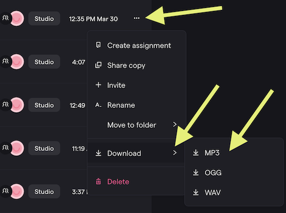

Every assignment in this class is turned in the same way. Learn it once.

## The Three Rules

### 1. An original name

Not *Untitled Score*, not *Untitled-3*, not just your last name. Make up a title nobody else would land on by accident: **Purple Car. Giant Fork. Toasted Pop Tarts Are Fire.** Some lessons give you a specific name instead — use it.

The name goes in two places and they match: the **title on the score or project** and the **file name**. Your name goes in the composer spot.

### 2. Export, then upload the file

Saving is not turning in. The project stays with you so you can keep working. What gets submitted is an **exported file** — never a share link unless the lesson says so.

### 3. Every required file, in one submission

MuseScore assignments need **two** files: an MP3 and a PDF. One without the other is an *incomplete* assignment. Video projects need the exported **video**, not an MP3 and not a Soundtrap link.

## Soundtrap: Export an MP3

1. Play the project once more and listen to the whole thing.
2. Open the **File** menu, choose **Export**, then **MP3**.
3. Save it somewhere you can find it (Downloads is fine).
4. Upload the MP3 to the assignment on CTLS.

<video controls src="/videos/Soundtrap-Export-and-CTLS-Upload-480p.mp4"></video>

## Soundtrap: Export a Video

For sound-for-screen projects.

1. **File → Export**, choose the **video** option, and save the file to your computer.
2. In the assignment's **discussion** on CTLS, click **Upload Video** and choose that file.
3. Post once. Your post appears after Mr. Willingham approves it.

Stop editing with 10 minutes left — exporting and uploading a video takes time.

## MuseScore: Export an MP3 and a PDF

| File | How | What it proves |
| --- | --- | --- |
| MP3 | **File → Export → MP3** | What the music sounds like |
| PDF | **File → Export → PDF** | What it looks like on the page |

Both carry the project's title: **Purple Car.mp3** and **Purple Car.pdf**. Upload **both** to the one assignment on CTLS. Save the `.mscz` file too — it is the only version you can keep editing.

The MP3 is audio only: anyone can press play, but there is nothing to look at. The PDF is the page: the notes, the repeat signs, the form, exactly as written, and it makes no sound. One file to hear it, one to see it.

## Files, Not Links

A Soundtrap share link, a MuseScore share link, or a screenshot is not a submission. If the lesson says MP3, upload an MP3. If it says video, upload a video.
