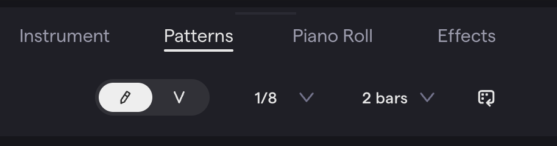

 **Tuesday, August 11th, 2026**

{}

## Objectives

- I can explain what MIDI is.
- I can add drum sounds to a Patterns Beatmaker grid.
- I can program the hi-hat and kick parts of a beat pattern.

{}

{}

## Warmup

We'll watch a video together about MIDI. In the video Colin explains what MIDI is. The Musical Instrument Digital Interface (MIDI) is a way for electronic instruments and computers to communicate. It allows you to control virtual instruments — like the drum sounds in Soundtrap — using a MIDI controller or by programming a pattern directly into a grid.

In the video he uses microcontrollers and MIDI to make a drum machine.

As you watch, answer these questions in your head:

1. What do the letters **M-I-D-I** stand for?
2. Is MIDI *sound* (aka audio) or *instructions* (telling an instrument what to play)?
3. What is *velocity*?

{}

### Checkpoint: Warmup

- [ ] I have watched the video.
- [ ] I can briefly explain what MIDI is and what the letters in MIDI stand for.

{}

{}

{}

## Work Session

### Introducing Patterns Beatmaker

Soundtrap has a built-in drum machine called the **Patterns Beatmaker**. Instead of dragging in pre-made loops, you build a beat one hit at a time on a grid — kind of like filling in boxes on a piece of graph paper. Each row is a drum sound, and each column is a moment in time. Click a box, and that drum plays at that moment.



From a new project, simply click the **Patterns Beatmaker** option in the middle of the screen.

**OR**

Add a new track and choose the pattern option.


Change the rhythm option from the default **1/16th** to **1/8th** notes. This will give you 8 steps per measure.

For length, choose **2 measures**. This will give you 16 steps total — 2 steps per beat, 8 beats per measure.



Click boxes in the grid to turn steps on and off for each drum sound. Press play to hear it loop.



### The Rock Beat Pattern

Today you are going to program the **Rock Beat** — a pattern built from a steady hi-hat, a kick on beats 1 and 3, and a snare on beats 2 and 4. The grid below has 16 steps — four steps per beat, four beats per pattern. An **X** means click that box.

| Step | 1 | 2 | 3 | 4 | 5 | 6 | 7 | 8 | 9 | 10 | 11 | 12 | 13 | 14 | 15 | 16 |
| --- | --- | --- | --- | --- | --- | --- | --- | --- | --- | --- | --- | --- | --- | --- | --- | --- |
| Closed Hi-Hat | X |  | X |  | X |  | X |  | X |  | X |  | X |  | X |  |
| Kick | X |  |  |  |  |  |  |  | X |  |  |  |  |  |  |  |
| Snare |  |  |  |  | X |  |  |  |  |  |  |  | X |  |  |  |


Today you are only programming the **hi-hat** and **kick** rows. You will add the **snare** and finish the pattern tomorrow.


Work one drum at a time:

1. Program the closed hi-hat first — click every other box (steps 1, 3, 5, 7, 9, 11, 13, 15).
2. Program the kick next — click step 1 and step 9 only.
3. Press play and listen. Does it sound like a steady groove yet?

If you finish early, try muting the hi-hat row for one loop through the pattern — how does the beat feel without it?

{}

### Checkpoint: Work Session

- [ ] I added a Patterns Beatmaker track with Kick, Snare, and Closed Hi-Hat sounds.
- [ ] I programmed the closed hi-hat on steps 1, 3, 5, 7, 9, 11, 13, and 15.
- [ ] I programmed the kick on steps 1 and 9.

{}

### Extras

You can experiment by adding additional sounds to your pattern, like a **Crash Cymbal** or **Open Hi-Hat**.

You can change the rhythm from 1/8th to 1/16th to get more steps for more control.

You can increase the length from 2 measures to 4 measures to make a longer pattern.

You can try **velocity** mode which gives you control over the loudness of each step.

{}

{}

## Closing

### Exit Ticket

Before you leave, be ready to answer:

1. What is MIDI, in your own words?
2. In the Rock Beat pattern, which steps does the kick play on?

Tomorrow we will add the snare and finish the Rock Beat pattern — it is due for a grade tomorrow, so save your project before you log off.

{}

## Standards

- [**MSMTC8.CR.1**](/music-technology/description/#msmtc8cr1) — Generate musical ideas for various purposes and contexts (programming rhythmic ideas step by step in Patterns Beatmaker).
- [**MSMTC8.CR.2**](/music-technology/description/#msmtc8cr2) — Select and develop musical ideas for defined purposes and contexts (choosing drum sounds and arranging them into a beat pattern).
