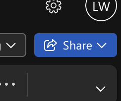
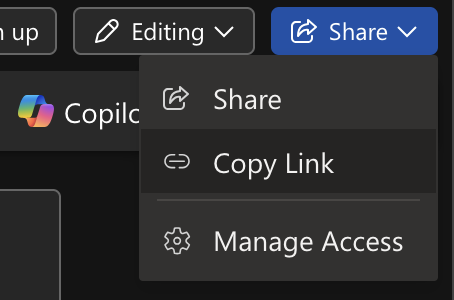
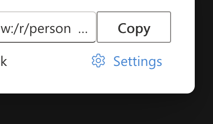
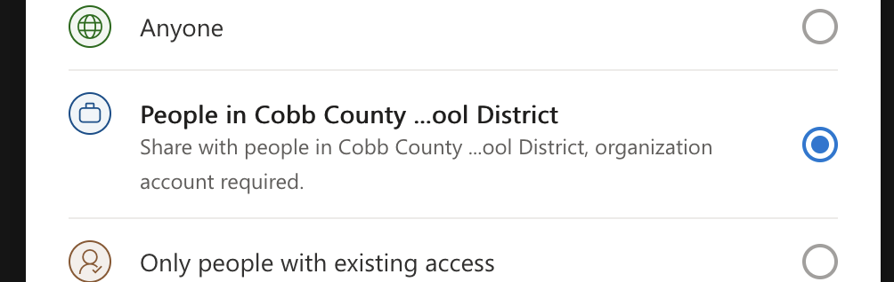
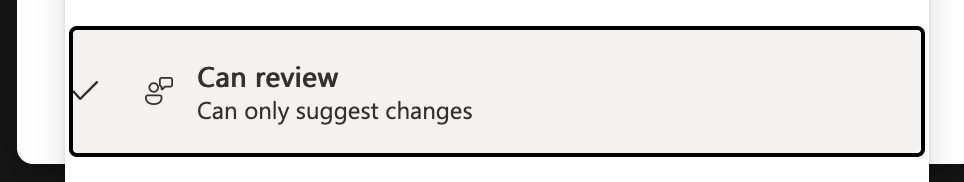
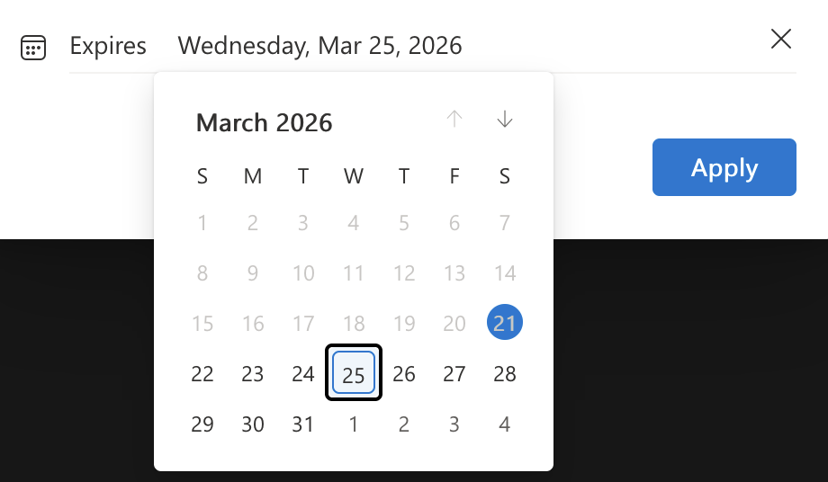
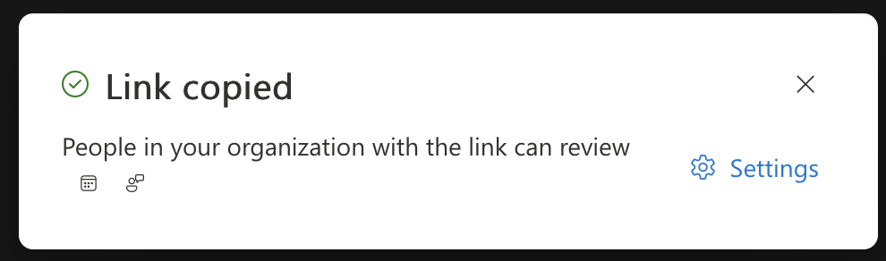

 **Wednesday, March 25th, 2026**

{}

## Objectives

- I can provide constructive feedback on a peer's podcast script.
- I can revise my script based on peer feedback.
- I can finalize my script so it is ready to record.

{}

{}

## Warmup: Prepare for Peer Review

Open your podcast script in Word Online. Read through it one more time on your own before sharing it.

Check that your script includes:

- An introduction with all five parameters (hook, name, podcast name, topic, preview)
- Main content with 2–3 clear points
- A conclusion that wraps up and signs off
- Audio annotations for music and sound effects
- A length of approximately 250–500 words

{}

### Checkpoint: Warmup

- [x] I have reread my script.
- [x] My script includes all required sections.

{}

{}

{}

## Work Session: Peer Feedback

You will read **two** classmates' scripts and provide constructive feedback. Mr. Willingham will explain the sharing procedure.

### What to Look For

When reading a peer's script, consider:

- Does the intro grab your attention?
- Is the topic clear and easy to follow?
- Are the main points organized in a logical order?
- Does the conclusion wrap things up?
- Are there audio annotations for music and sound effects?
- Does the script sound natural when you read it in your head? Would you want to listen to this podcast?

### How to Give Feedback

Be **specific** and **helpful**. Instead of "it's good," say what's working and why. Instead of "fix this part," explain what's unclear and suggest how to improve it.

### Now Share

To share your script, follow these steps:




Click the **Share** button in the top right corner of Word Online.





Click on **Copy Link**.





Click on **settings**.





Click on **People in Cobb County School Districy**.





Choose the **Can Review** permission level.





Set an expiration date for tomorrow.





Press **apply** and the link is ready to turn in.





Paste the link into the discussion post on CTLS and submit it.

It will look like this:

> https://cobbk12org-my.sharepoint.com/:w:/g/personal/your_name_cobbk12_org/IQDtehj98DJH98fjKJKFK898fgfs7eSbb-u34Fp-U7e=k1111v






{}

### Checkpoint: Peer Feedback

- [x] I have read two peers' scripts.
- [x] I have provided specific, constructive feedback on each one.

{}

{}

{}

## Work Session: Revise & Finalize

Now use the feedback you received to improve your script.

1. Read through the feedback from your peers.
1. Make revisions — fix anything that's unclear, awkward, or missing.
1. Use the **Read Aloud** feature in Word to listen to your revised script. Make final adjustments.
1. Fix any remaining spelling and grammar issues using the Editor.

Your script is **due today**. It must be complete and ready for recording tomorrow.

> **Tip:** Break long paragraphs into short lines. When you're reading into a microphone, short lines are much easier to follow than big blocks of text.

{}

### Checkpoint: Revise & Finalize

- [x] I have revised my script based on peer feedback.
- [x] I have used Read Aloud to listen to my script.
- [x] My script is finalized and ready for recording.

{}

{}

{}

## Closing: Next Steps

Tomorrow is **recording day**. You will set up the microphone and audio interface and record your full podcast episode in GarageBand. Come prepared with your finalized script and your intro music from Tuesday.

{}
