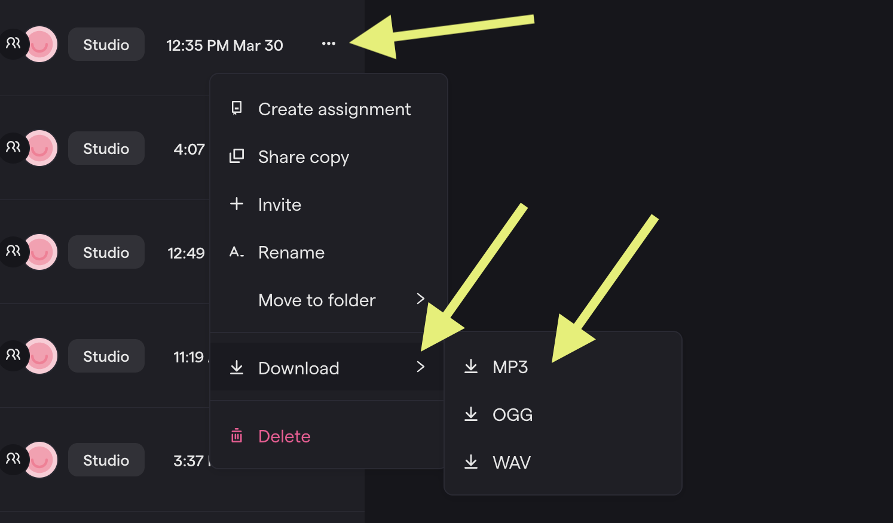
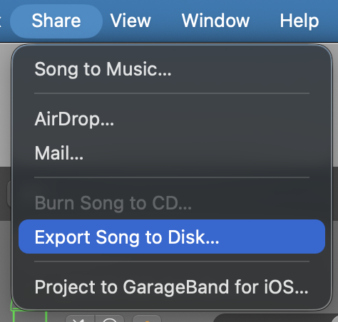
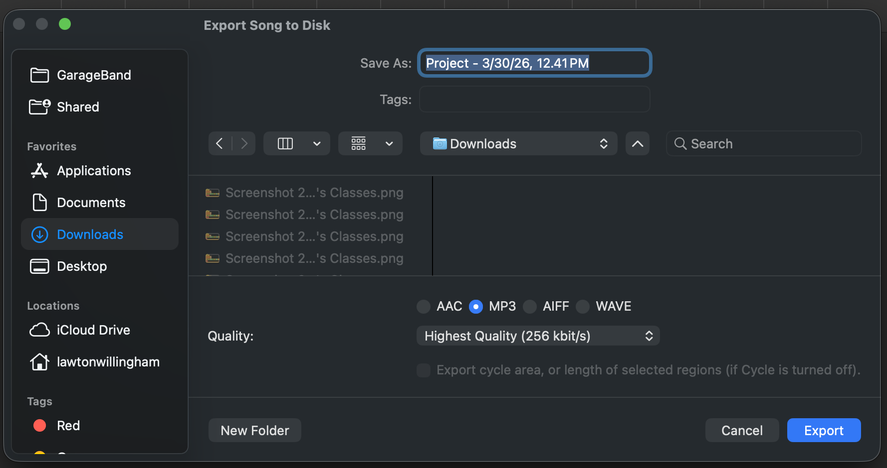

 **Monday, March 30th, 2026**

<!-- OPTIONAL: Uncomment for announcements, sub plans, schedule changes, etc.
{}
Mr. Willingham is out today. Please follow the instructions below.
{}
-->

{}

## Objectives

- I can produce a completed podcast using professional tools and applications.

{}

{}

## Warmup: Recording & Editing Best Practices

Read the [Podcast Recording & Editing Guide](../podcast-recording-and-editing-guide/) carefully. This guide covers the best practices for recording and editing a podcast.

As you read, think about your own podcast:

- What recording tips can you still apply as you finish up?
- Are there any editing techniques you haven't tried yet?

{}

### Checkpoint: Warmup

- [x] I have read the Podcast Recording & Editing Guide.
- [x] I have identified at least one tip I can apply to my podcast today.

{}

{}

{}

## Work Session

1. Finish your podcast.
2. Export it as an MP3.
3. Upload it to CTLS to share.
4. Listen to other student podcasts.
5. Leave constructive comments on other student work.


You may use the microphones for the first 15 minutes of class only. After that, you must use the built-in microphone on your computer.


### Export MP3 From Soundtrap

### Export MP3 From GarageBand

You only need to export from GarageBand if you did your music in GarageBand.

  
CLICK HERE to see how to Export MP3 from GarageBand

{}

### Checkpoint: Work Session

- [ ] I have submitted my work
- [ ] I have listened to and left comments on other student work.

{}

{}

{}

## Closing

We'll wrap up the podcast unit with a brief discussion.

{}

## Standards

- [**MSMTC8.CR.3**](/music-technology/description/#msmtc8cr3) — Evaluate and refine selected musical ideas to create musical work that meets appropriate criteria.
- [**MSMTC8.CR.4**](/music-technology/description/#msmtc8cr4) — Share creative musical work that conveys intent, demonstrates craftsmanship, and exhibits originality.
- [**MSMTC8.RE.4**](/music-technology/description/#msmtc8re4) — Support evaluations of musical works and performances based on analysis, interpretation, and established criteria.
