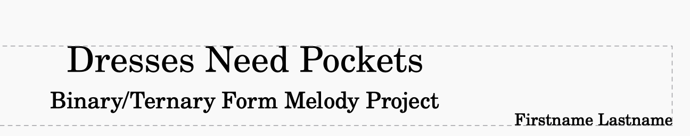

 **Monday, August 31st, 2026**

{}

## Objectives

- I can read notes in treble and bass clef.
- I can compose a complete piece in binary or ternary form with sections of at least eight measures.
- I can write a simple bass line using only the tonic and the dominant.
- I can wrap a form in repeat signs so the whole piece plays twice.
- I can export a score as both an MP3 and a PDF and explain the difference.

{}

{}

## Warmup: Music Reading Practice

Note reading is a speed skill. You either know the note the moment you see it, or you are counting lines while the music keeps going.

Run both of these until the timer goes off — split your time between them:

- [Treble clef practice](https://www.musictheory.net/exercises/note/bg1yryyynyyfwbb)
- [Bass clef practice](https://www.musictheory.net/exercises/note/ngwyryyynyyfwbb)

### Quiz Friday

There is a **quiz this Friday, September 4th**, on **music reading and form** — naming notes in treble and bass clef, telling binary from ternary, and knowing your **tonic** from your **dominant**. Thursday is the review day. Today's warmup is not busywork; it is the quiz material.

{}

### Checkpoint: Warmup

- [ ] I practiced both the treble clef and bass clef exercises.
- [ ] I know the quiz is Friday and what is on it.

{}

{}

{}

## Work Session: Compose One Complete Piece

Today you write **one full piece, start to finish, in one class period**. You already know every skill this takes — today you put them together.

### The Requirements

- **Form:** binary (**A B**) or **ternary** (**A B A**). Your choice.
- **Section length:** every section is **at least 8 measures**. Binary is at least 16 measures; ternary is at least 24.
- **Notes:** only notes from the **C major** and **A minor** scales. That is the seven letters A through G — **no sharps, no flats**. If you see a ♯ or ♭ on your score, something went wrong. **Any octave is allowed** — high, low, or anywhere in between, as long as the letters stay A through G.
- **Rhythms:** sixteenth notes, eighth notes, quarter notes, half notes, and whole notes. Mix them.
- **Repeat signs:** wrap the **entire form** in repeat signs — a start repeat at the very first measure, an end repeat at the very last. The whole piece plays through **twice**.
- **Melody:** one note at a time on the top staff. No chords in the melody.
- **Bass line — required.** Add a bass staff and write a simple bass line under the melody using **only two notes: the tonic and the dominant**. In C major that is **C and G**; in A minor it is **A and E**. Keep it low, keep it steady — one note per measure is plenty. (Tonic and dominant are on Friday's quiz, so consider this a head start.)

- **Title block:** an **original title** you made up, the subtitle **Binary/Ternary Form Melody Project**, and **your name**. All three go at the top of the score.

Here is how the top of your score should look — original title, matching subtitle, your name:

An example score with a simple tonic–dominant bass line, and a recording of it, are on today's CTLS post.

Dynamics, articulations, ornaments, tempo markings — **optional, and welcome**. They will not be graded, but they will make your piece sound like you meant it.

### Advice Worth Taking

- **Pick a home note first.** C major means home is **C**; A minor means home is **A**. End your last measure on the home note, on a longer value like a half or whole note, so the ending sounds finished instead of abandoned.
- **Make B actually different.** Different starting note, different register, different rhythm — at least two of those. If a listener cannot hear where B starts, it is not a B section.
- **Melody first, bass line after.** Write each section's melody, then drop the bass line in underneath. Two notes to choose from means the bass line is the fast part — do not let it eat your melody time.
- **Dominant in the middle, tonic at the end.** A bass note on the dominant at the halfway point makes the music lean forward; the tonic in the final measure brings it home.
- **Ternary players:** copy and paste your A section for the return — bass line included. That is not cheating — that is what ternary form is.
- **Watch the clock.** Eight measures by the halfway point or you are behind.

{}

### Checkpoint: Work Session

- [ ] My piece is in binary or ternary form with sections of at least 8 measures.
- [ ] Every note is from C major / A minor — no sharps or flats anywhere.
- [ ] Repeat signs wrap the whole form, first measure to last.
- [ ] My bass line uses only the tonic and the dominant, under every section.
- [ ] My score shows an original title, the subtitle **Binary/Ternary Form Melody Project**, and my name.

{}

{}

{}

## Work Session: Export and Submit — MP3 and PDF

You are turning in **two files** today, and they do two different jobs:

- The **MP3 is audio only** — it is the *sound* of your piece. Anyone can press play, but there is nothing to look at.
- The **PDF is viewable** — it is the *page*: the notes, the repeat signs, the form, exactly as written. It makes no sound at all.

One file to hear it, one file to see it. That is why you always submit both.

### Export

1. Check the top of your score one last time: **original title, subtitle, your name.** The title is also your file name.
2. **File → Export**, choose **MP3**, save it under your title.
3. **File → Export** again, choose **PDF**, same title.
4. Upload **both files** to the assignment on CTLS. **Files, not links.**

{}

### Checkpoint: Submit

- [ ] I exported an **MP3** (the audio) and a **PDF** (the notation).
- [ ] Both files are uploaded to CTLS.
- [ ] My MuseScore file is saved.

{}

{}

{}

## Closing: Tomorrow We Listen

Tomorrow we play these for the class, so finish like someone is going to hear it — because someone is.

### Closing Question

Think about this — you may be called on to share your answer out loud.

You had one period to write a whole piece. What did you spend the most time on, and would you split your time the same way if you did it again?

{}

### Checkpoint: Closing

- [ ] Both files are submitted on CTLS.
- [ ] I practiced my note reading — the quiz is **Friday**.

{}

{}

## Standards

- [**MSMTC8.CR.2**](/music-technology/description/#msmtc8cr2) — Select and develop musical ideas for defined purposes and contexts (composing an original melody within a defined form and scale).
- [**MSMTC8.CR.3**](/music-technology/description/#msmtc8cr3) — Evaluate and refine musical ideas to create musical work that meets appropriate criteria (checking a composition against form, scale, and rhythm requirements).
- [**MSMTC8.CR.4**](/music-technology/description/#msmtc8cr4) — Share creative musical work that conveys intent, demonstrates craftsmanship, and exhibits originality (exporting and submitting a finished original composition in two formats).
