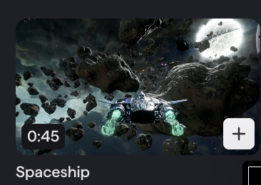
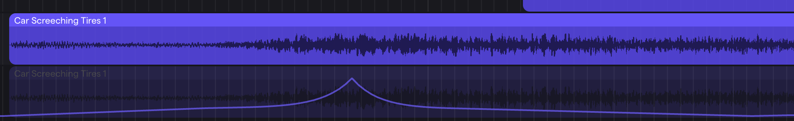

 **Friday, September 18th, 2026**

{}
You get **today** and **Monday after fall break** to work in class. Next week is fall break — no classes. The project is due at the end of class on **Monday, 9/28**.
{}

{}

## Objectives

- I can build a soundtrack for a silent clip using a sound I recorded myself.
- I can change a sound with effects and shape it with volume automation.
- I can match the key moments on screen to prominent sounds.

{}

{}

## Warmup: Read the Requirements and Rubric

Read the **Project Requirements** and the **Rubric** below, all the way through, before you open Soundtrap. Then pick your clip.

{}

### Checkpoint: Warmup

- [ ] I read all five requirements.
- [ ] I read the rubric and know how each row is scored.
- [ ] I picked my clip.

{}

{}

{}

## Work Session: Build the Soundtrack

### Pick one clip

All three are in Soundtrap's **Video Library**.

| Spaceship (0:45) | Futuristic City (0:34) | Flowers (0:40) |
| :---: | :---: | :---: |
|  |  |  |

### Set up

1. Open Soundtrap → **New Project** → choose the video option.
2. Open the **Video Library** and add your clip.
3. Name the project **Sound Design Project**.
4. Drag in your **found sound** — the recording you turned in for homework.


**Found sound turned in late?** You can still submit it on CTLS for partial credit. You still need it for this project.


### Project Requirements

1. **Found sound.** Use at least one sound you recorded yourself.
2. **Effects.** Change your sounds with a combination of effects.
3. **Automation.** Draw a volume curve on at least one track.
4. **Sound throughout.** Sound or music plays from the first frame to the last. No dead silence.
5. **Sync.** Every key moment on screen lands on a prominent sound.

You may also use any sounds and music loops from the Soundtrap library.

### Effects to try

- **Reverb** — puts the sound in a space: small room, big hall, cave, outer space.
- **Delay** — echoes. Short time + high feedback makes a sci-fi charge-up.
- **EQ** — cut the highs to muffle, cut the lows to thin it out, boost the lows for a heavy hit.
- **Distortion** — grit and crunch. Turn the volume down to compare fairly.
- **Modulation** — chorus (wide shimmer), flanger (jet swoosh), phaser (bubbly sweep), tremolo (volume wobble).
- **Pitch shift** — drop your found sound low to make it big, raise it high to make it small.

Stack two or three on one track. Change the order and listen again.

### Automation

Anything that moves toward or past the camera gets a **curve**, not a straight line: quiet for a long time, a fast rise as it passes, then a fast drop. Same as the Urban Runner vehicles.

Ideas: the ship or an asteroid flying past, the plane crossing the skyline, a swell as the flower opens.

### Rubric

Each row is worth 20 points. **Total: 100.**

| Requirement | 20 — Full | 10 — Partial | 0 — Missing |
| --- | --- | --- | --- |
| **Found sound** | My own recording is in the project and you can hear it. | It's in the project but buried or hard to hear. | No found sound. |
| **Effects** | Two or more different effects clearly change my sounds. | One effect, or effects you can't really hear. | No effects. |
| **Automation** | A volume curve on at least one track matches movement on screen. | Automation is there but it's a straight line or doesn't match the picture. | No automation. |
| **Sound throughout** | Sound or music from the first frame to the last. | One or two silent gaps. | Mostly silent. |
| **Sync** | Every key moment lands on a prominent sound. | Some key moments are missed or noticeably late/early. | Sounds don't line up with the picture. |

{}

### Checkpoint: Work Session

- [ ] My found sound is in the project and I can hear it.
- [ ] I used at least two different effects.
- [ ] At least one track has a volume curve.
- [ ] There is sound or music the whole time.
- [ ] Every key moment lands on a prominent sound.

{}

{}

{}

## Closing

Save your project. Monday after break is your last work day.

**To turn it in:** export the project as a **video** and upload it to the CTLS assignment. A Soundtrap link or an MP3 is not a submission.

**Exit ticket:** Which moment in your clip needs the biggest sound, and what are you going to use for it?

{}

### Checkpoint: Closing

- [ ] My project is saved as Sound Design Project.
- [ ] I know which requirements I still owe.
- [ ] I answered the exit ticket.

{}

{}

## Standards

- [**MSMTC8.CR.1**](/music-technology/description/#msmtc8cr1) — Generate musical ideas for various purposes and contexts (building a soundtrack for a silent clip from a self-recorded found sound).
- [**MSMTC8.CR.2**](/music-technology/description/#msmtc8cr2) — Select and develop musical ideas for defined purposes and contexts (transforming sounds with effects and automation to fit the picture).
- [**MSMTC8.CR.4**](/music-technology/description/#msmtc8cr4) — Share musical work that demonstrates musical and technological craftsmanship (exporting and submitting a finished sound design project).
