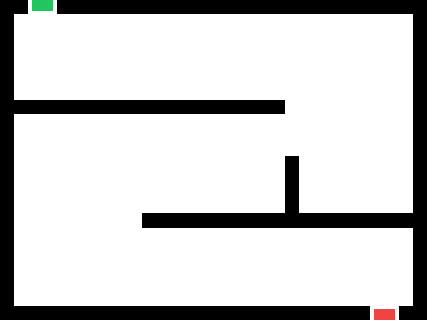
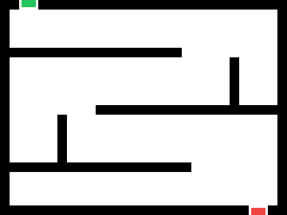
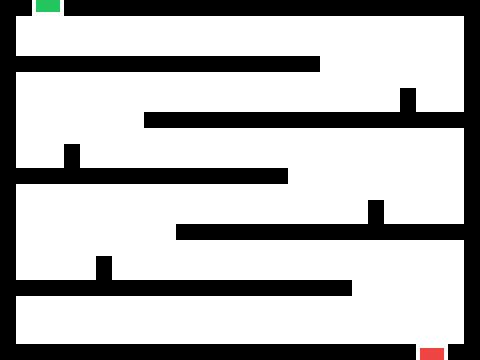

The first real game of the course. You design a maze on paper, swap with a partner, draw your partner's maze in Scratch, then make it playable with events, conditionals, and a loop.

## Schedule

| Project Day | Plan |
| ----------- | ---- |
| 1 | **Maze Design** — analyze example mazes, design one on the worksheet, swap and review, draw your partner's maze in Scratch |
| 2 | **Controls and Walls** — arrow-key movement, then an `if touching color` wall reset inside a `forever` loop |
| 3 | **Loops + Conditionals** — a collectable coin, a `score` variable, and a win condition, built from a blank project |

## Project Day 1: Maze Design

### Analyze Example Mazes

Look at the three mazes. Which is easiest? Which is hardest? Why? What makes a maze fun, and what makes it frustrating? How wide do the paths need to be for a small sprite to fit?




<div style="background-color:gray; width: fit-content; margin: 0 auto;">



</div>




<div style="background-color:gray; width: fit-content; margin: 0 auto;">



</div>




<div style="background-color:gray; width: fit-content; margin: 0 auto;">



</div>




### Design Rules

- **40 squares wide × 30 squares tall** — the shape of the Scratch stage.
- **Paths at least 2 squares wide** — so a sprite fits without touching the walls.
- **Clear start and finish** — mark them **S** and **F**.
- **At least one dead end.**
- **Solvable** — at least one path from start to finish.

### Design, Swap, Review

worksheet/

1. **Design (about 8 minutes).** Sketch your maze on the worksheet in pencil. Follow every rule. Trace the solution lightly to make sure it works.
2. **Swap and review (about 3 minutes).** Trade with your partner. Trace a path from start to finish on their maze. Can you solve it? Are the paths wide enough? Write one piece of feedback on the back.
3. **Return.** End with your **partner's** maze. That is the one you build.

### Draw the Maze in Scratch

<!-- TODO: new link — confirm the maze starter project is still shared -->
https://scratch.mit.edu/projects/1293617748

1. Select the **Maze** sprite and its grid costume. The grid matches the 40 × 30 worksheet.
2. Use the **fill** tool to color the walls, all in one color. Delete the squares that are paths. Keep paths at least two squares wide.
3. Add a small sprite from the library to be the player, shrink it if needed, and place it at the start.

See [Scratch Art Tools](/scratch/reference/art-tools/) for the fill tool and shapes.

## Project Day 2: Controls and Walls

Open the maze project. Lost it? Remix the starter project above and draw a quick maze.

### Keyboard Controls

Add four `when key pressed` blocks to the player sprite, one per arrow key — the [Arrow-Key Movement](/scratch/reference/code-patterns/#arrow-key-movement) pattern. Click the green flag and navigate from start to finish. If the paths are too tight or the sprite moves too fast, change `10` to `5`.

### Wall Collision

Right now the sprite walks through walls. Add the [Wall Reset](/scratch/reference/code-patterns/#wall-reset) pattern: a `forever` loop with `if touching color` that sends the sprite back to the start.

- Click the color swatch in `touching color` and use the **eyedropper** to pick the exact wall color.
- Set the `go to` coordinates to the start position. Drag the sprite there and read x and y below the stage.
- If your walls are their own sprite, `touching [Maze v]?` works too.

**Challenge:** instead of resetting to the start, undo the last move when the sprite touches a wall. You will need to move the opposite direction by the same amount.

## Project Day 3: Loops and Conditionals

Start from a **blank** project. Build a program with all four of these:

1. A sprite the player moves with the arrow keys or WASD. Use either movement pattern from [Code Patterns](/scratch/reference/code-patterns/).
2. A coin or other collectable that adds 1 to `score` when touched, then jumps to a random position — the [Score and Collect](/scratch/reference/code-patterns/#score-and-collect) pattern.
3. A `forever` loop containing at least **two** `if` blocks that respond to different events.
4. A `score` variable that changes when a condition is met.

Ideas for the second condition: touching a wall color resets the position; the score reaching 10 says "You win!" and stops the game.

```scratch
if <(score) = (10)> then
  say [You win!] for (2) seconds
  stop [all v]
end
```

### Why the Loop Matters

Without the `forever` loop, each `if` block runs once when the green flag is clicked and then stops. The loop makes Scratch check every condition **every frame** while the game runs. That is the game loop pattern, and nearly every game you have played is built on it.

## Checkpoints

**Day 1**

- [ ] My maze follows all five design rules.
- [ ] I reviewed my partner's maze and left one piece of feedback.
- [ ] My partner's maze is drawn in Scratch with a player sprite at the start.

**Day 2**

- [ ] Four `when key pressed` blocks move the player.
- [ ] A `forever` loop with `if touching color` sends the player back to the start.
- [ ] I used the eyedropper to pick the exact wall color.

**Day 3**

- [ ] My project has a `forever` loop with at least two `if` blocks inside it.
- [ ] A `score` variable goes up when the player touches the collectable.
- [ ] The collectable moves to a new position after it is collected.

## Teacher Notes

- Day 1 is a paper day for the first half. Pencils, not pens — students revise after the swap.
- Students build their **partner's** maze, which is why the design rules matter: an unsolvable or too-narrow maze becomes someone else's problem.
- Day 2 pairs well with an Edpuzzle on user input as the warmup; Day 3 pairs well with a Code.org loops lesson.
- The Day 3 build-from-blank is the first independent check of whether the patterns stuck. Keep the starter-project link handy for anyone who has lost their work.
