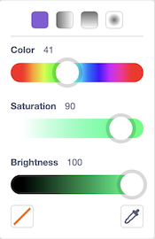
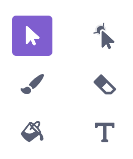

When you make a game in Scratch, how it looks matters as much as how it works. The paint editor is where you draw sprites, costumes, and backdrops. Learn these tools and use them on purpose.

## Opening the Paint Editor

- To draw a **sprite**, hover over the **Choose a Sprite** button (bottom right of the stage) and click the **paintbrush**.
- To draw a **backdrop**, hover over **Choose a Backdrop** and click the paintbrush.
- To edit an existing sprite or backdrop, select it and click the **Costumes** (or **Backdrops**) tab at the top left.

## Color Selection

1. Color slider
2. Saturation slider
3. Brightness slider
4. Color picker (eyedropper)

<figure>

<figcaption>Color tools</figcaption>
</figure>

The **eyedropper** picks a color that is already on the canvas. It also shows up inside the `touching color` block, where it is the easiest way to match a wall color exactly.

## Primitive Shapes

Hold `shift` while drawing to make perfect squares, circles, and straight lines.

1. Line tool
2. Circle tool
3. Rectangle tool

<figure>

<figcaption>Primitive shape tools</figcaption>
</figure>

Primitive shapes have clean edges and solid fills, which makes collision detection reliable. Prefer them over freehand drawing for walls, platforms, and player characters.

## Other Tools

1. Paintbrush
2. Fill
3. Select
4. Text
5. Reshape
6. Eraser

<figure>

<figcaption>Other tools</figcaption>
</figure>

## Tips for Game Art

- Keep player sprites **small and simple** — about 30–40 pixels wide for a platformer, 50–60 for a catch game.
- Use a **solid fill** with no transparent gaps inside a character. Gaps confuse the `touching` block.
- Draw all the walls of a maze, or all the platforms of a level, in **one costume on one sprite**. One `touching` check then covers all of them.
- Use the same color for every wall so `touching color` works.

## Art Challenges

Practice with these when you have a few spare minutes:

- Paint a castle using only the rectangle and circle tools.
- Paint a landscape (trees, mountains) using only the line tool.
- Paint a vehicle using only the brush.
