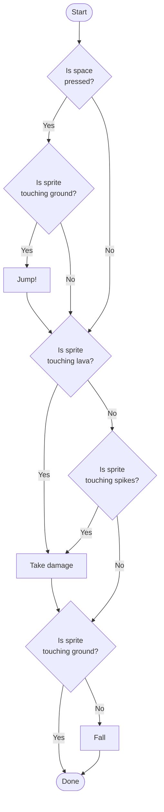
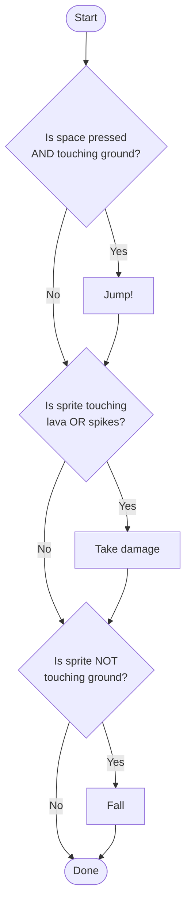

An `if` block checks one **condition** — something that is either `true` or `false`. A value that is only ever true or false is called a **boolean**. When you need to check more than one thing at once, you combine conditions with the three boolean operators.

## The Three Operators

| Operator | Result |
| -------- | ------ |
| `and` | `true` only when **both** conditions are true |
| `or` | `true` when **at least one** condition is true |
| `not` | Flips a condition — `true` becomes `false`, `false` becomes `true` |

In Scratch they are green, live in the **Operators** category, and are shaped like pointed ovals so they fit in the diamond-shaped slot of an `if` block.

```scratch
not < >
< > and < >
< > or < >
```

## `and`

Use `and` when two things must be true at the same time.

```scratch
when green flag clicked
forever
  if <<key [space v] pressed?> and <touching [ground v]?>> then
    change y by (100)
  end
end
```

The player can only jump while pressing space **and** standing on the ground. Without `and`, the player could jump in midair.

## `or`

Use `or` when either thing should trigger the result.

```scratch
when green flag clicked
forever
  if <<touching [lava v]?> or <touching [spikes v]?>> then
    go to x: (-200) y: (0)
  end
end
```

Touching lava **or** spikes resets the player. One `if` instead of two.

## `not`

Use `not` when something should happen only while a condition is **false**.

```scratch
when green flag clicked
forever
  if <not <touching [ground v]?>> then
    change y by (-5)
  end
end
```

The player falls while **not** touching the ground. This is the heart of every gravity system in the [Platformer](/scratch/projects/platformer/).

## Predicting the Result

Work from the inside out. Evaluate each condition, then apply the operator.

```scratch
when green flag clicked
set [level v] to (4)
set [power v] to (55)
if <<(power) > (50)> and <(level) > (3)>> then
cast_firebolt
end
```

- `power > 50` → `55 > 50` → **true**
- `level > 3` → `4 > 3` → **true**
- `true and true` → **true**, so `cast_firebolt` runs.

If `power` were `30`: `false and true` → **false**. With `and`, both sides must be true.

More worked examples: [Boolean Operators: Practice Questions](/scratch/reference/practice/boolean-practice/).

## Why Operators Shrink Your Code

Imagine a platformer where the sprite must jump only when space is pressed **and** it is on the ground, take damage when it touches lava **or** spikes, and fall when it is **not** on the ground.

### Without boolean operators

Every condition needs its own diamond, and some get checked twice.



### With boolean operators

Each decision becomes one diamond.



Same logic, half the diagram. See [Flow Diagrams](/scratch/reference/flowcharts/) for the shapes.
