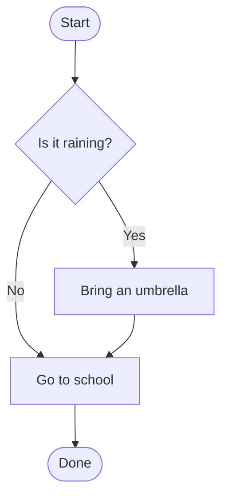
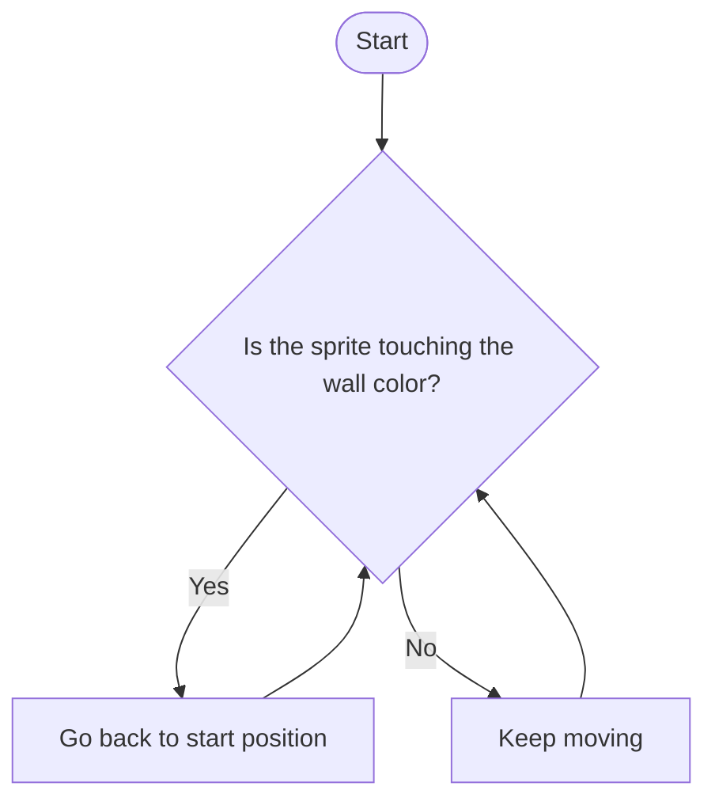
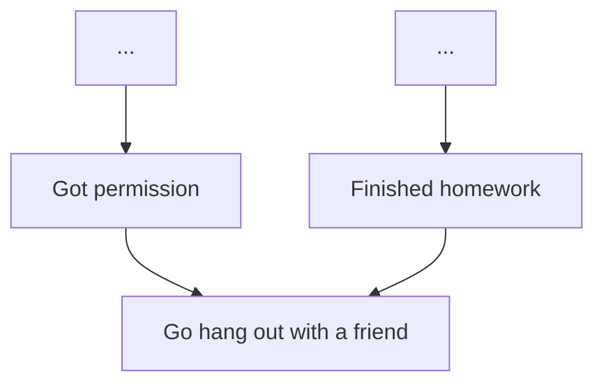
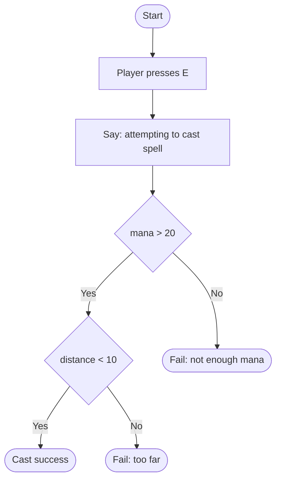
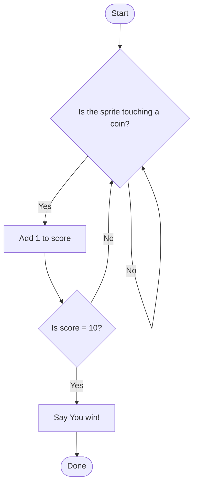

A flow diagram is a picture of the steps a program follows and the decisions it makes along the way. Programmers draw them to plan logic **before** writing code.

## The Shapes

| Shape | Meaning | Example |
| ----- | ------- | ------- |
| **Oval** | Start or End | "Start", "Done" |
| **Rectangle** | Action (do something) | "Eat breakfast", "Go to school" |
| **Diamond** | Decision (a yes/no question) | "Is it raining?" |

**Arrows** connect the shapes and show the direction the program flows. A diamond always has **two arrows** leaving it — one for **Yes** and one for **No**.



The diamond is the **condition** — the same thing that goes inside an `if` block. The Yes and No paths are the code inside `if` and `else`.

## Loops

When an arrow points back to an earlier shape, that part of the program **repeats**. This diagram is a maze game's wall check:



Both paths return to the question, so the check runs over and over. In Scratch, that is a `forever` loop with an `if` inside.

## Converging Paths

Two different paths can come back together at the same step.



## Tracing a Diagram

To trace a diagram, pick a starting input, then follow the arrows one shape at a time. At each diamond, answer the question for your input and take that arrow. Write down every step. If you never reach an end oval, or a diamond has no arrow for your answer, the diagram is broken.

## From Diagram to Scratch

Each diamond becomes an `if` block. A diamond nested inside another diamond's Yes path becomes an `if` inside an `if`. Arrows that loop back become a `forever` or `repeat until`.

<div style="display: grid; grid-template-columns: 1fr 1fr; gap: 1rem;">
<div>



</div>
<div>

```scratch
when [e v] key pressed
say [Attempting to cast spell]
if <(mana) > (20)> then
    if <(cast distance) < (10)> then
        say [Cast success!]
    else
        say [Fail: Too far]
    end
else
    say [Fail: Not enough mana]
end
```

</div>
</div>

Try it: write the Scratch blocks that match this diagram. Pseudocode is fine.



Which parts are `if` blocks? Which parts repeat? What order do the blocks go in?

## Printables and Examples

- [Flow Diagram Worksheet](worksheet/) — the paper activity: trace, draw two diagrams, swap and trace a partner's.
- [Example: Invisibility Power-Up](example/) — a student diagram for a game power-up.
- [Boolean Operators](/scratch/reference/boolean-operators/) — how `and`, `or`, and `not` combine diamonds.
