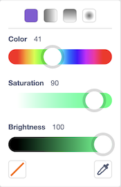
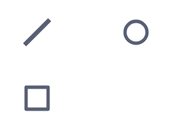
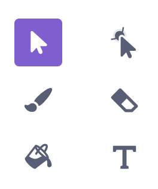

# Monday, March 16th, 2026



- I can make a Scratch project.
- I can use Scratch blocks to make a sprite move.
- I can use the art tools to paint a backdrop.





Go to [scratch.mit.edu](https://scratch.mit.edu) and login with the information Mr. Willingham gives you.

Then, click "Create" to start a new project. Choose the tutorial titled "Getting Started". Watch the video and follow along with the instructions in the tutorial.



- [x] I have logged in to Scratch
- [x] I have completed the video in the "Getting Started" tutorial
- [x] I completed the steps following the video in the "Getting Started" tutorial







We'll walk through the art tools in Scratch together. When making apps in Scratch, making them looked good is all about using the art tools effectively. Code is important, but the art tools are just as important. So, let's learn how to use them!

We'll use all of the following to paint a backdrop for today's Scratch project.

#### Color Selection

1. Color slider
1. Saturation slider
1. Brightness slider
1. Color picker

<figure>

<figcaption>Color Tools</figcaption>
</figure>

#### Primitive Shapes

Hold (or don't hold) the shift key while using to draw perfect shapes.

1. Line tool
1. Circle tool
1. Rectangle tool

<figure>

<figcaption>Primitive Shape Tools</figcaption>
</figure>

#### Other Tools

1. Paintbrush tool
1. Fill tool
1. Select tool
1. Text tool
1. Reshape
1. Eraser

<figure>

<figcaption>Other Tools</figcaption>
</figure>



- [x] I have used the art tools to paint a backdrop.
- [x] I understand the advantage of using the primitive shapes over painting freehand.
- [x] I understand how to use the color picker tool to select colors.
- [x] I understand how to use the color, saturation, and brightness sliders to select colors.







In this class, our goal is to learn the programming skills necessary to make a full game by the end of the nine weeks. Each student will group up or work alone in the last two weeks of the class to produce a final project.



## Standards

- [**MS-CS-FCP.4.1**](/scratch/description/#ms-cs-fcp4) — Develop a working vocabulary of programming including coding, user interfaces, usability, and programming language.
- [**MS-CS-FCP.4.5**](/scratch/description/#ms-cs-fcp4) — Implement a simple algorithm in a computer program.
