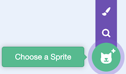
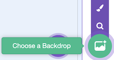

 **Thursday, March 19th, 2026**

{}

## Objectives

- I can use the `when green flag clicked` event block to start my program.
- I can make a sprite move using motion blocks.
- I can build a sequence of blocks that runs in order.
- I can have multiple sprites doing different things at the same time.

{}

{}

## Warmup: Yesterday's Backdrop

You practiced sequencing and debugging on Code.org Tuesday. Today, we will continue learning about sequencing and debugging, but in Scratch.

1. Go to [scratch.mit.edu](https://scratch.mit.edu) and login.
2. Create a new project.
3. Practice using the art tools to paint a backdrop.

Take a moment to look at the **Motion** category in the block palette (the blue blocks). Try dragging a few motion blocks into the code area and clicking on them to see what they do.

{}

### Checkpoint: Warmup

- [x] I have logged in to Scratch and opened my project from day 1.
- [x] I have tried clicking on at least two motion blocks to see what they do.

{}

{}

{}

## Work Session: Part 1: Motion & Sequences

### What is a `Sequence`?

A **sequence** is a set of instructions that run in order, one after the other. In Scratch, we build sequences by snapping blocks together from top to bottom. The computer follows our instructions exactly in the order we give them.

### The Green Flag - an `Event`

Every Scratch program needs a starting point. The `when green flag clicked` block (found in the **Events** category) tells Scratch: _"Start running the blocks below me when the user clicks the green flag."_

Without this block, your code won't run on its own.

> `Events` are essential for game design. Every time a user clicks a button or moves the mouse or objects collide, an event can be generated. These events can be used to trigger code to run.

### Your Task

Build a program that does the following **in sequence** when the green flag is clicked:

1. **Glide** the sprite to one spot on the stage.
2. **Say** something for 2 seconds.
3. **Glide** the sprite to a different spot.
4. **Say** something else for 2 seconds.
5. **Glide** the sprite back to where it started.

<div style="display: grid; grid-template-columns: 1fr 1fr; gap: 1rem;">

```scratch
when green flag clicked
```

```scratch
glide (1) secs to x: [ ] y: [ ]
```

```scratch
say [ ] for (2) seconds
```

</div>

{}

### Checkpoint: Part 1

- [x] My program starts with a `when green flag clicked` block.
- [x] My sprite moves to at least two different positions using `glide` blocks.
- [x] My sprite says something using `say` blocks.
- [x] My blocks are snapped together in a sequence that runs in order.

{}

{}

{}

## Work Session: Part 2: Sprites and The Stage

Each sprite is its own independent codable object in Scratch. This means you can have multiple sprites each with unique behavior.

The Stage can also have its own code. You can change the appearance of the stage by changing the backdrop.

### Your Task

<div style="display: grid; grid-template-columns: 1fr 1fr; gap: 1rem;">

1. Create a new sprite by clicking on the `Choose a Sprite` button. Choose one from the library.
1. Give this second sprite its own code. Follow the same steps as in part 1, but for this second sprite. When you run the code, both sprites should be doing their own thing at the same time!
1. **Bonus** On the stage, add two new backdrops. Choose from the library.
1. **Bonus** Add code to the Stage that changes the backdrop when the green flag is clicked or when something else happens in your program.

<div>
<figure>

<figcaption>Choose a Sprite Button</figcaption>
</figure>
<figure>

<figcaption>Choose a Backdrop Button</figcaption>
</figure>
</div>

</div>

{}

### Checkpoint: Part 2

- [x] I have created a second sprite.
- [x] I have added code to the second sprite that runs when the green flag is clicked.
- [x] When I click the green flag, both sprites are doing something at the same time.

{}

{}

{}

## Closing: Exit Ticket

You'll need to answer the following question on CTLS. Use complete sentences and be clear in your explanation.

- What is the difference between a sprite and the stage in Scratch?

---

### Finished Early?

Try some of these blocks out in Scratch. Try something on your own in Scratch. Explore the art tools in Scratch.

```scratch

when [space v] key pressed
pick a block to go here

```

```scratch

attach this to something
go to [random position v]

```

```scratch

when green flag clicked
forever
if on edge, bounce
move (10) steps

```

{}

## Standards

- [**MS-CS-FCP.3.2**](/scratch/description/#ms-cs-fcp3) — Develop a working vocabulary of computational thinking including sequences and algorithms.
- [**MS-CS-FCP.4.1**](/scratch/description/#ms-cs-fcp4) — Develop a working vocabulary of programming including coding, user interfaces, programming language, and events.
- [**MS-CS-FCP.4.5**](/scratch/description/#ms-cs-fcp4) — Implement a simple algorithm in a computer program.
- [**MS-CS-FCP.4.6**](/scratch/description/#ms-cs-fcp4) — Develop an event driven program.
