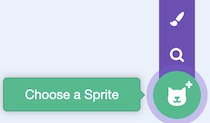
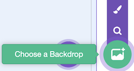

 **Thursday, October 15th, 2026**

{}
Early release today. Finish Part 1 before moving to Part 2.
{}

{}

## Objectives

- I can use the `when green flag clicked` event block to start my program.
- I can make a sprite move with motion blocks.
- I can build a sequence of blocks that runs in order.
- I can have multiple sprites doing different things at the same time.

{}

{}

## Warmup: Motion Blocks

1. Log in to [Scratch](https://scratch.mit.edu) and open yesterday's project, or create a new one.
2. If you did not finish your backdrop yesterday, finish it now.
3. Look at the **Motion** category (the blue blocks). Drag a few into the code area and click them to see what they do.

{}

### Checkpoint: Warmup

- [ ] I opened my project.
- [ ] I clicked at least two motion blocks to see what they do.

{}

{}

{}

## Work Session: Part 1: Motion and Sequences

A **sequence** is a set of instructions that run in order, one after another. In Scratch you build a sequence by snapping blocks together from top to bottom.

Every program needs a starting point. `when green flag clicked` (in **Events**) tells Scratch to run the blocks below it when the user clicks the green flag. Without an event block, your code does not run on its own. Events are how games work: a key press, a click, or a collision can all trigger code.

Build a program that does the following **in sequence** when the green flag is clicked:

1. **Glide** the sprite to one spot on the stage.
2. **Say** something for 2 seconds.
3. **Glide** to a different spot.
4. **Say** something else for 2 seconds.
5. **Glide** back to where it started.

<div style="display: grid; grid-template-columns: 1fr 1fr; gap: 1rem;">

```scratch
when green flag clicked
```

```scratch
glide (1) secs to x: [ ] y: [ ]
```

```scratch
say [ ] for (2) seconds
```

</div>

{}

### Checkpoint: Part 1

- [ ] My program starts with `when green flag clicked`.
- [ ] My sprite glides to at least two positions.
- [ ] My sprite says something.
- [ ] The blocks are snapped together in a sequence that runs in order.

{}

{}

{}

## Work Session: Part 2: Sprites and the Stage

Each sprite is its own codable object with its own scripts. The Stage can have code too, and its appearance is a **backdrop**.

<div style="display: grid; grid-template-columns: 1fr 1fr; gap: 1rem;">

1. Click **Choose a Sprite** and pick one from the library.
2. Give the second sprite its own sequence, like Part 1. When you click the green flag, both sprites should do their own thing at the same time.
3. **Bonus:** add two backdrops from the library.
4. **Bonus:** add code to the Stage that switches the backdrop when the green flag is clicked or when something else happens.

<div>
<figure>

<figcaption>Choose a Sprite</figcaption>
</figure>
<figure>

<figcaption>Choose a Backdrop</figcaption>
</figure>
</div>

</div>

{}

### Checkpoint: Part 2

- [ ] I created a second sprite.
- [ ] The second sprite has its own code that runs on the green flag.
- [ ] Both sprites do something at the same time.

{}

{}

{}

## Closing: Exit Ticket

Answer on CTLS in complete sentences:

- What is the difference between a sprite and the stage in Scratch?

### Finished Early?

Try these blocks and see what happens.

```scratch
when [space v] key pressed
go to [random position v]
```

```scratch
when green flag clicked
forever
if on edge, bounce
move (10) steps
```

{}

## Standards

- [**MS-CS-FCP.3.2**](/scratch/description/#ms-cs-fcp3) — Develop a working vocabulary of computational thinking including sequences and algorithms (the glide-say-glide sequence).
- [**MS-CS-FCP.4.1**](/scratch/description/#ms-cs-fcp4) — Develop a working vocabulary of programming including events and user interfaces (the green flag event, sprites, and the stage).
- [**MS-CS-FCP.4.5**](/scratch/description/#ms-cs-fcp4) — Implement a simple algorithm in a computer program.
- [**MS-CS-FCP.4.6**](/scratch/description/#ms-cs-fcp4) — Develop an event driven program (code that starts on the green flag).
