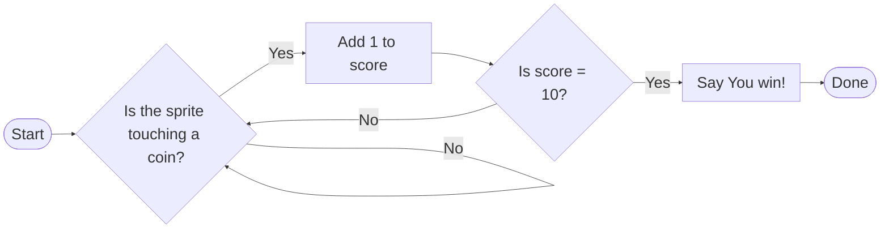

 **Friday, March 27th, 2026**

{}

## Objectives

- I can use a `forever` loop with `if` blocks inside it to respond to game events.
- I can explain why `if` blocks are often placed inside `forever` loops in games.
- I can build a Scratch program that combines loops and conditionals.

{}

{}

## Warmup: Which Block Do I Need?

This week you learned two powerful tools:

- **Conditionals** (`if` blocks) — do something *only when* a condition is true
- **Loops** (`forever`, `repeat # times`) — do something *over and over*

For each scenario below, call out which block you would use — `forever`, `repeat # times`, or `if`:

| Scenario | `forever` | `repeat # times` | `if` |
|---|---|---|---|
| Draw a square (move and turn 4 times) |  | | |
| Keep checking if the player is touching a wall | | | |
| Do something only when the score reaches 10 | | | |
| Bounce a sprite off the edge for the whole game | | | |
| Repeat a dance move 8 times | | | |

On Day 8 you drew this flow diagram and wrote pseudocode for it:



Today we build it.

{}

### Checkpoint: Warmup

- [ ] I can tell the difference between a loop and a conditional.
- [ ] I understand that in this diagram, the arrows that loop back mean the code runs over and over.

{}

{}

{}

## Work Session: The Game Loop

Most games use the same pattern: a `forever` loop with `if` blocks inside it. The loop keeps the game running every frame, and the `if` blocks check whether something important happened.

Here's what that looks like in Scratch:

```scratch
when green flag clicked
forever
if <touching [Coin v]?> then
change [score v] by (1)
end
if <touching [edge v]?> then
say [Ouch!] for (1) seconds
go to x: (0) y: (0)
end
end
```

**Why does the `forever` loop matter?** Without it, each `if` block would only run once when the green flag is clicked — then stop. The `forever` loop makes Scratch check those conditions *every frame* while the game is running.

### Build Your Own

Starting from a **blank Scratch project**, build a program that has all four of the following:

1. **A sprite the player can move** using arrow keys or WASD

You'll have to make the movement code yourself. Look at an earlier project if you forgot how.

2. **A coin** or something else collectable that increases the score when touched

When the player touches the coin, you can use the `change [score v] by (1)` block to increase the score variable.

Then you can use the `go to [random position v]` block to move the coin somewhere else on the stage.

3. **A `forever` loop** that contains at least **two `if` blocks** responding to different events

You can use the example code above as a starting point.

4. **A `score` variable** that increases when a condition is met

To add a variable, go to the **Variables** category and click **Make a Variable**. Name it `score`.


Some ideas for your two conditions:

- Touching a coin sprite → add 1 to score
- Touching a wall color → reset position
- Score reaching 10 → say "You win!" and stop

{}

### Checkpoint: Work Session

- [ ] My project has a `forever` loop.
- [ ] My `forever` loop contains at least two `if` blocks.
- [ ] My `score` variable changes when a condition is met.

{}

{}

{}

## Closing: Show and Tell

A few volunteers will share their projects. Hit the Share button in Scratch. Mr. Willingham will add your project to a Studio Page so other students can see it.

Some questions to think about as you play someone else's project:

- Where is the `forever` loop?
- What conditions are inside it?
- What happens when each condition is true?

**Key takeaway:** Almost every game you've ever played — Mario, Minecraft, anything — runs on this exact pattern. A loop that never stops, checking conditions every single frame. You just built that.

{}

## Useful Blocks

<div style="display: grid; grid-template-columns: 1fr 1fr; gap: 1rem;">
<div>

```scratch
when green flag clicked

forever
end

if <> then
end

set [score v] to (0)

change [score v] by (1)

if <(score) = (10)> then
say [You win!] for (2) seconds
stop [all v]
end
```
</div>
<div>

```scratch
if <key [right arrow v] pressed?> then
change x by (10)
end

change y by (10)

go to (random position v)

go to x: (0) y: (0)

hide

show

if <touching [Coin v]?> then
change [score v] by (1)
end
```
</div>
</div>

## Standards

- [**MS-CS-FCP.3.2**](/scratch/description/#ms-cs-fcp3) — Develop a working vocabulary of computational thinking including sequences, algorithms, and iteration (loops).
- [**MS-CS-FCP.4.1**](/scratch/description/#ms-cs-fcp4) — Develop a working vocabulary of programming including coding, debugging, variables, loops, conditionals, and events.
- [**MS-CS-FCP.4.5**](/scratch/description/#ms-cs-fcp4) — Implement a simple algorithm in a computer program.
- [**MS-CS-FCP.4.8**](/scratch/description/#ms-cs-fcp4) — Create a computer program that implements a loop.
