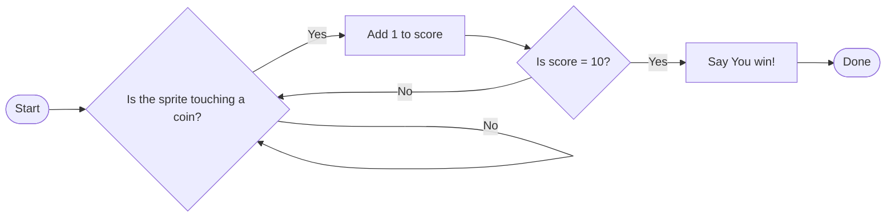

 **Friday, October 23rd, 2026**

{}

## Objectives

- I can use a `forever` loop with `if` blocks inside it to respond to game events.
- I can explain why `if` blocks are usually placed inside `forever` loops in games.
- I can build a Scratch program that combines loops and conditionals.

{}

{}

## Warmup: Which Block Do I Need?

This week you learned **conditionals** (`if` — do something *only when* a condition is true) and **loops** (`forever`, `repeat` — do something *over and over*). For each scenario, decide in your head which block you would use:

| Scenario | `forever` | `repeat` | `if` |
| --- | --- | --- | --- |
| Draw a square (move and turn four times) | | | |
| Keep checking whether the player is touching a wall | | | |
| Do something only when the score reaches 10 | | | |
| Bounce a sprite off the edge for the whole game | | | |
| Repeat a dance move eight times | | | |

On Wednesday you wrote pseudocode for this diagram. Today you build it.

```mermaid
flowchart LR
    A([Start]) --> B{Is the sprite touching a coin?}
    B -- Yes --> C[Add 1 to score]
    C --> D{Is score = 10?}
    D -- Yes --> E[Say You win!]
    D -- No --> B
    B -- No --> B
    E --> F([Done])
```

{}

### Checkpoint: Warmup

- [ ] I can tell the difference between a loop and a conditional.
- [ ] I see that the arrows looping back mean the code runs over and over.

{}

{}

{}

## Work Session: The Game Loop

Most games run on one pattern: a `forever` loop with `if` blocks inside. The loop keeps the game running every frame; the `if` blocks check whether something happened. Without the loop, each `if` would run once and stop.

Follow **Project Day 3** on the [Maze Game](/scratch/projects/maze-game/#project-day-3-loops-and-conditionals) page. Starting from a **blank** project, build:

1. A sprite the player moves with the arrow keys or WASD.
2. A coin that adds 1 to `score` and moves to a random position when touched — [Score and Collect](/scratch/reference/code-patterns/#score-and-collect).
3. A `forever` loop with at least **two** `if` blocks responding to different events.
4. A `score` variable that changes when a condition is met.

Ideas for the second `if`: touching a wall color resets the position; `score = 10` says "You win!" and stops everything.

{}

### Checkpoint: Work Session

- [ ] My project has a `forever` loop.
- [ ] The loop contains at least two `if` blocks.
- [ ] My `score` variable changes when a condition is met.

{}

{}

{}

## Closing: Show and Tell

Volunteers share their projects. Click **Share** in Scratch; Mr. Willingham adds them to the class studio (see [Share to the Class Studio](/scratch/reference/share-to-studio/)).

As you play someone else's project, find the `forever` loop, the conditions inside it, and what happens when each one is true.

Almost every game you have played — Mario, Minecraft, anything — runs on this exact pattern. You just built it.

{}

## Standards

- [**MS-CS-FCP.3.2**](/scratch/description/#ms-cs-fcp3) — Develop a working vocabulary of computational thinking including iteration and branches (the game loop).
- [**MS-CS-FCP.4.1**](/scratch/description/#ms-cs-fcp4) — Develop a working vocabulary of programming including variables, loops, conditionals, and events.
- [**MS-CS-FCP.4.5**](/scratch/description/#ms-cs-fcp4) — Implement a simple algorithm in a computer program (the coin-collecting diagram as code).
- [**MS-CS-FCP.4.8**](/scratch/description/#ms-cs-fcp4) — Create a computer program that implements a loop.
