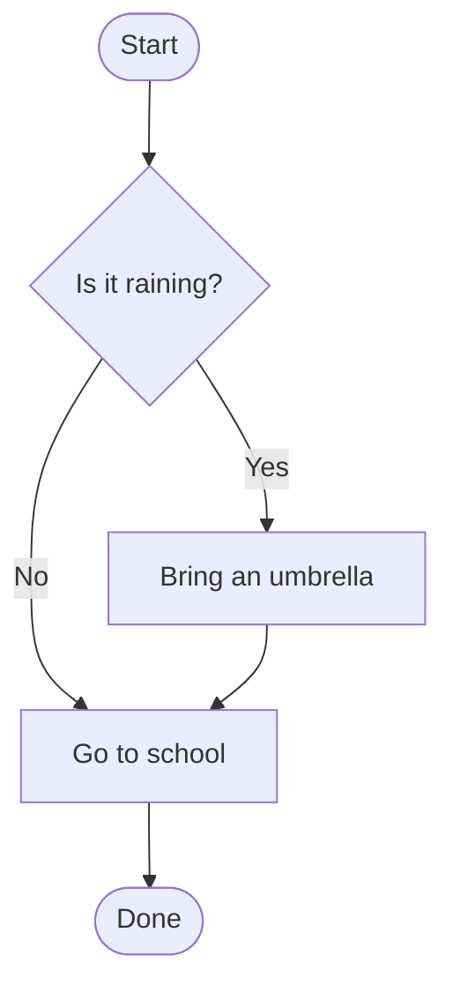
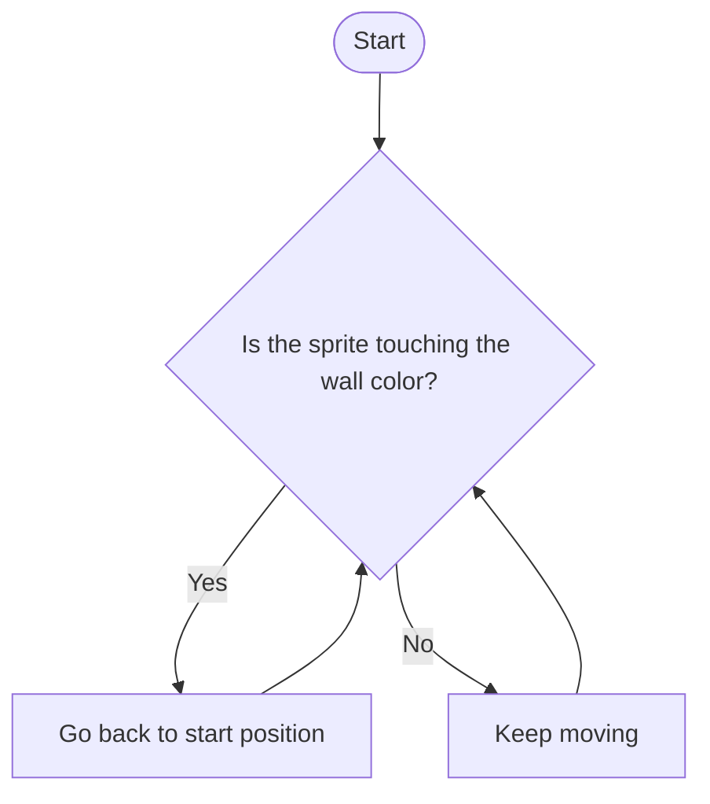

 **Wednesday, March 25th, 2026**


Read the entire objective, warmup, work session, and closing sections before you start working. This will help you understand the big picture of what we're doing today.


{}

- I can read a flow diagram and predict its outcome.
- I can draw a flow diagram that represents a conditional (if/else) decision.
- I can connect flow diagrams to `if` blocks in Scratch.

{}

{}

Yesterday you learned the vocabulary of conditionals — `if`, `else if`, `else`, and how programs use conditions to decide what to do. Today we're going to **draw** that logic on paper using **flow diagrams**.

A flow diagram is a picture that shows the steps a program follows and the decisions it makes along the way. There are three shapes you need to know:

| Shape         | Meaning                       | Example                         |
| ------------- | ----------------------------- | ------------------------------- |
| **Oval**      | Start or End                  | "Start", "Done"                 |
| **Rectangle** | Action (do something)         | "Eat breakfast", "Go to school" |
| **Diamond**   | Decision (yes or no question) | "Is it raining?"                |

**Arrows** connect the shapes and show which direction the program flows. A diamond always has **two arrows** coming out — one for **Yes** and one for **No**.

Mr. Willingham will walk through an example on the board:

> **"Is it raining?"** → Yes: Bring an umbrella → Go to school / No: Go to school

Notice how the diamond is the **condition** — the same thing that goes inside an `if` block in Scratch. The two paths (Yes and No) are like the code inside `if` and `else`.

{}

- [x] I understand the three flow diagram shapes (oval, rectangle, diamond).
- [x] I understand that a diamond is a yes/no decision — just like a condition in an `if` block.

{}

{}

{}

In this example, identify the condition and find loops. Loops are when the flow goes back to an earlier point in the diagram. This indicates code that will repeat.

1. What is the condition in this flow diagram?
1. Where are there loops? What is repeated?

{}

- [x] I can identify the condition in a flow diagram.
- [x] I can identify loops in a flow diagram.

{}

{}

{}

With a partner, create a flow diagram with at least three conditions based on the following scenario:

> A friend has just messaged you that they've finished their homework and want to hang out.

1. What yes/no conditions will impact whether, when, and where you can hang out with your friend?
1. BONUS: Add a loop to your flow diagram. This is a condition that gets checked over and over again like, "Is my homework done yet?" where the answer `no` would loop back to the same question and the answer `yes` would move forward.

{}

- [x] I can draw a flow diagram that represents a conditional (if/else) decision.
- [x] I can include at least three conditions in my flow diagram.
- [x] BONUS: I can include a loop in my flow diagram.

{}

{}

{}

Look at this side-by-side. The flow diagram from Diagram 2 on your worksheet maps directly to the Scratch code you wrote on Monday:

| Flow Diagram                                          | Scratch                           |
| ----------------------------------------------------- | --------------------------------- |
| **Diamond:** "Is the sprite touching the wall color?" | `if touching color?`              |
| **Yes arrow → Rectangle:** "Go back to start"         | `go to x: (-200) y: (150)`        |
| **No arrow →** continue                               | (the code outside the `if` block) |

Flow diagrams and `if` blocks are two ways of representing the same logic. Diagrams make it easier to **plan** your logic before you code it. Tomorrow, you'll dig deeper into the **true/false** values that power every diamond and every `if` block — that's called **boolean logic**.

{}

## Standards

- [**MS-CS-FCP.3.2**](/scratch/description/#ms-cs-fcp3) — Develop a working vocabulary of computational thinking including sequences, algorithms, and iteration (loops).
- [**MS-CS-FCP.4.1**](/scratch/description/#ms-cs-fcp4) — Develop a working vocabulary of programming including flowcharting and/or storyboarding, coding, debugging, user interfaces, usability, variables, lists, loops, conditionals, programming language, and events.
