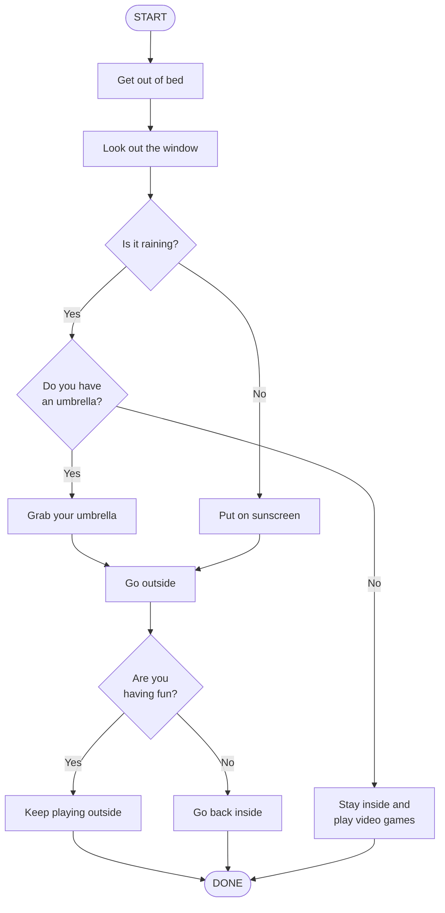

## Work in Progress

```mermaid
flowchart TD
    A([START]) --> B[Get out of bed]
    B --> C[Look out the window]
    C --> D{Is it raining?}

    D -- "Yes" --> E{Do you have\nan umbrella?}
    D -- "No" --> F[Put on sunscreen]

    E -- "Yes" --> G[Grab your umbrella]
    E -- "No" --> H[Stay inside and\nplay video games]

    G --> I[Go outside]
    F --> I

    I --> J{Are you\nhaving fun?}
    J -- "Yes" --> K[Keep playing outside]
    J -- "No" --> L[Go back inside]

    K --> M([DONE])
    L --> M
    H --> M
```
