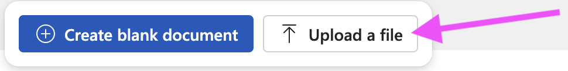

 **Wednesday, November 11th, 2026**

{}

## Objectives

- I can describe a Game Design Document and its purpose.
- I can fill in the Overview and Gameplay sections of my team's GDD.
- I can share a Word Online document with my team and Mr. Willingham.

{}

{}

## Warmup: What Is a GDD?

Game studios write a **Game Design Document** before writing any code. It answers: What is the game about? Who are the characters? How do you play, win, and lose? What does the world look like? What sounds and music does it use? A GDD keeps the whole team building the same game.

Professional GDDs run many pages. Yours is much shorter, but the same ideas apply.

{}

{}

## Work Session: Set Up and Fill In


Only one person sets this up. Then everyone edits the same document.


{}

### Log in to Office 365

https://office365.cobbk12.org/

### Download the template

/downloads/game-design-document-template.docx

### Open Word Online and upload it

https://www.office.com/launch/word

### Share it

Share with every team member **and** Mr. Willingham (`lawton.willingham@cobbk12.org`), set to *Can edit*.

### Fill it in together

You do not have to finish today, but complete at least:

- **Cover page** — game title, studio name, team members and roles
- **Team Roles** — responsibilities for each person
- **Overview** — Introduction, Genre, Target Audience
- **Gameplay** — Objectives, Scoring and Levels, Controls

{}

Write in complete sentences. Be specific: "the player presses the arrow keys to move" beats "you move." Everyone contributes, even if one person types.

{}

### Checkpoint: Work Session

- [ ] Our GDD is in Word Online and shared with the team and Mr. Willingham.
- [ ] The cover page, team roles, overview, and gameplay sections are started.

{}

{}

{}

## Closing

Whatever is unfinished, you can work on Friday. Tomorrow is box art — bring colored pencils or markers.

{}

## Standards

- [**MS-CS-FCP.1.1**](/scratch/description/#ms-cs-fcp1) — Communicate effectively through writing (complete sentences in the GDD).
- [**MS-CS-FCP.1.2**](/scratch/description/#ms-cs-fcp1) — Demonstrate an understanding of collaborative interactions in the digital world (a shared, co-edited document).
- [**MS-CS-FCP.4.2**](/scratch/description/#ms-cs-fcp4) — Utilize the design process to brainstorm and plan an idea before implementing it.
