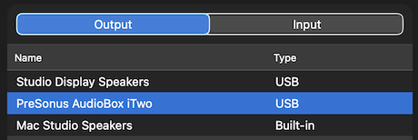
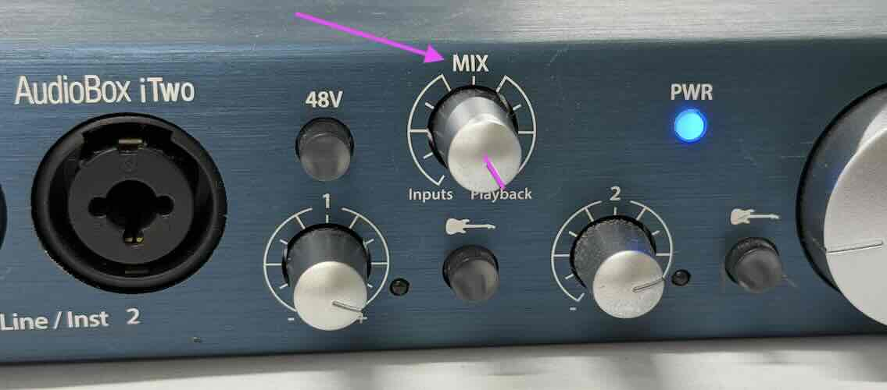
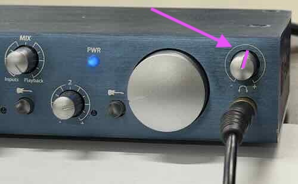

# Sound Issues

If you have issues with the sound on your computer...

1. Check that the blue Audio Interface is plugged in.
1. Open the volume settings page with `option` + `🔊` (option volume)
    - In the volume settings page, make sure "Presonus AudioBox iTwo" is selected as the output device.
    - On your keyboard, the option key may be labeled `alt` or `opt` or `⌥`
    - 
1. Check that the `Mix` knob on the AudioBox iTwo is turned all the way to the right (towards `Playback`).
    - 
1. Adjust the `Volume` knob on the AudioBox iTwo. This is the **small** knob next to where the headphones are plugged in.
    - 